# Práctica 1.1. Rangos

## Objetivo de la práctica

Al finalizar esta práctica, serás capaz de:

- Utilizar la función `range()` para generar secuencias numéricas.
- Emplear ciclos `for` para recorrer rangos de valores.
- Construir programas que generen secuencias utilizando un incremento definido por el usuario.

---

# Objetivo visual

Durante esta práctica desarrollarás un programa que genere secuencias numéricas utilizando la función `range()`.

```text
        Abrir Visual Studio Code
                   │
                   ▼
         Crear el archivo p1_1.py
                   │
                   ▼
     Generar múltiplos de 5
                   │
                   ▼
      Mostrar la secuencia
                   │
                   ▼
 Solicitar un incremento al usuario
                   │
                   ▼
 Generar una nueva secuencia
                   │
                   ▼
      Analizar los resultados
```

---

## Duración aproximada

**8 minutos**

---

# Tabla de ayuda

| Recurso | Valor |
|---------|-------|
| Editor | Visual Studio Code |
| Lenguaje | Python 3 |
| Archivo | `p1_1.py` |
| Funciones utilizadas | `print()`, `input()`, `range()`, `int()` |
| Ciclo utilizado | `for` |

---

# Instrucciones

## Tarea 1. Mostrar los múltiplos de 5

### Paso 1. Crear un nuevo archivo

Crear un archivo llamado:

```text
p1_1.py
```

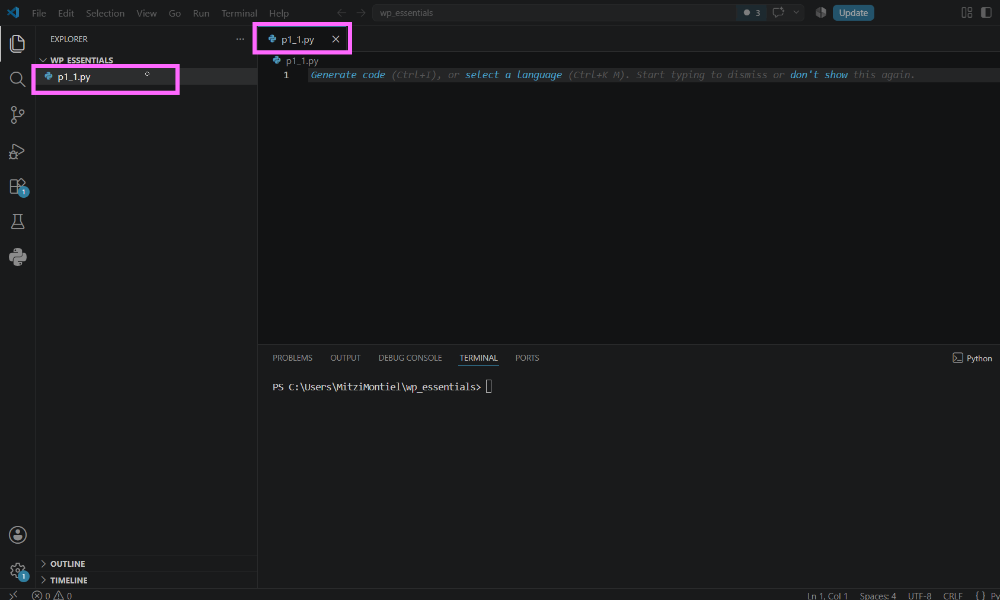

---

### Paso 2. Escribir el siguiente código

Agregar el siguiente programa.

```python
for numero in range(0, 101, 5):
    print(numero, end=", ")
```

Guardar el archivo.

> **Nota:** El parámetro `end=", "` permite mostrar todos los valores en una misma línea separados por coma y espacio.

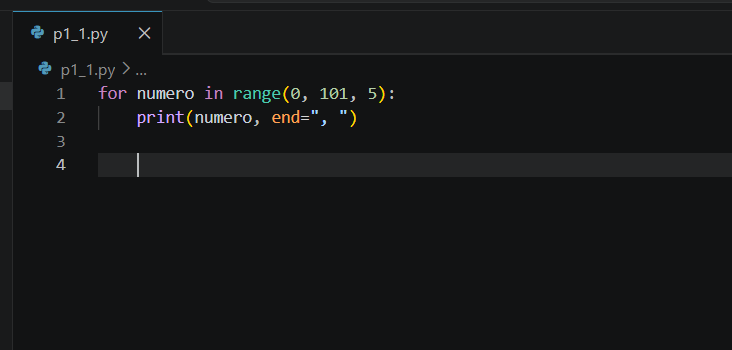


---

### Paso 3. Ejecutar el programa

Ejecutar el archivo utilizando el botón **Run Python File** o mediante la terminal.

```bash
python p4_1.py
```

Verificar que la salida sea similar a la siguiente:

```text
0, 5, 10, 15, 20, 25, ...
```

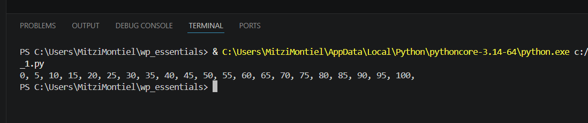

---

## Tarea 2. Permitir que el usuario defina el incremento

### Paso 1. Modificar el programa

Reemplazar el código anterior por el siguiente.

```python
incremento = int(input("Ingrese el incremento: "))

for numero in range(0, 101, incremento):
    print(numero, end=", ")
```

Guardar el archivo.

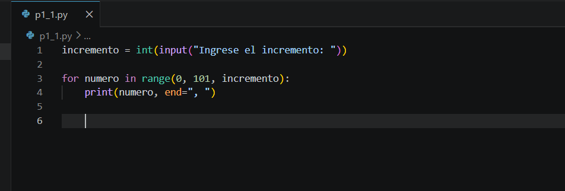

---

### Paso 2. Ejecutar el programa

Ejecutar nuevamente el programa.

Cuando el sistema lo solicite, ingresar el valor:

```text
10
```

Observar la salida obtenida.

```text
0, 10, 20, 30, 40, 50, 60, 70, 80, 90, 100
```

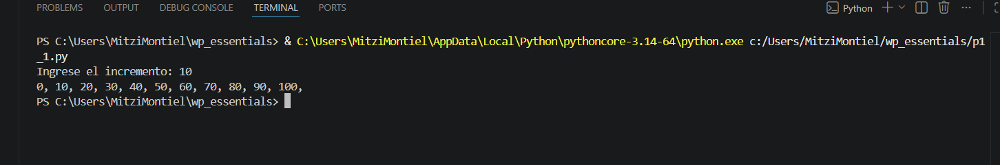


---

### Paso 3. Experimentar con diferentes incrementos

Ejecutar nuevamente el programa utilizando distintos valores de incremento.

Por ejemplo:

- 2
- 4
- 8
- 20

Responder:

- ¿Qué sucede cuando el incremento es menor?
- ¿Qué ocurre cuando el incremento es mayor?

> **Desafío:** ¿Qué ocurre si el usuario ingresa el valor **0** como incremento? Analice el mensaje mostrado por Python.

---

## Tarea 3. Analizar el uso de `range()`

Responder las siguientes preguntas.

1. ¿Cuántos parámetros puede recibir la función `range()`?

2. ¿Qué representa el primer parámetro?

3. ¿Qué representa el segundo parámetro?

4. ¿Qué representa el tercer parámetro?

5. ¿Por qué el número **101** fue utilizado como límite superior en lugar de **100**?

---

# Validación

Verifique que realizó correctamente las siguientes actividades.

| Actividad | Completado |
|------------|------------|
| Creó el archivo `p4_1.py` | ☐ |
| Utilizó la función `range()` | ☐ |
| Utilizó un ciclo `for` | ☐ |
| Mostró los múltiplos de 5 | ☐ |
| Solicitó un incremento al usuario | ☐ |
| Generó nuevas secuencias utilizando diferentes incrementos | ☐ |
| Respondió las preguntas de análisis | ☐ |

---

# Resultado esperado

Al finalizar la práctica el programa deberá generar una secuencia numérica utilizando la función `range()`.

Ejemplo:

```text
Ingrese el incremento:
10

0, 10, 20, 30, 40, 50, 60, 70, 80, 90, 100
```
---

# Conclusión

En esta práctica aprendiste a utilizar la función `range()` para generar secuencias numéricas y recorriste dichas secuencias mediante un ciclo `for`. También comprobaste cómo el tercer parámetro de `range()` controla el incremento entre cada elemento de la secuencia.

El uso de `range()` simplifica la generación de secuencias y evita tener que incrementar manualmente una variable dentro de un ciclo.

---

# Conocimientos adquiridos

Al finalizar esta práctica aprendiste a:

- Utilizar la función `range()`.
- Recorrer secuencias mediante ciclos `for`.
- Generar múltiplos de un número.
- Solicitar datos al usuario mediante `input()`.
- Construir secuencias con incrementos personalizados.
- Comprender el funcionamiento de los parámetros de `range()`.

---

# Práctica 1.2. Menú

## Objetivo de la práctica

Al finalizar esta práctica, serás capaz de:

- Implementar un menú interactivo utilizando ciclos y estructuras condicionales.
- Validar la entrada del usuario para controlar el flujo del programa.
- Construir un programa que permanezca en ejecución hasta que el usuario decida salir.

---

# Objetivo visual

Durante esta práctica desarrollarás un programa que mostrará un menú de opciones y ejecutará diferentes acciones según la selección del usuario.

```text
           Abrir Visual Studio Code
                     │
                     ▼
           Crear el archivo p1_2.py
                     │
                     ▼
              Mostrar el menú
                     │
                     ▼
          Solicitar una opción
                     │
          ┌──────────┴──────────┐
          ▼                     ▼
     Opción válida         Opción inválida
          │                     │
          ▼                     ▼
 Ejecutar la acción       Mostrar mensaje
          │
          ▼
 ¿Seleccionó Salir?
      │          │
     No          Sí
      │          ▼
      └────► Finalizar
```

---

## Duración aproximada

**8 minutos**

---

# Tabla de ayuda

| Recurso | Valor |
|---------|-------|
| Editor | Visual Studio Code |
| Lenguaje | Python 3 |
| Archivo | `p1_2.py` |
| Estructuras utilizadas | `while`, `if`, `elif`, `else` |
| Funciones utilizadas | `input()`, `print()`, `int()` |

---

# Instrucciones

## Tarea 1. Crear el menú interactivo

### Paso 1. Crear un nuevo archivo

Crear un archivo llamado:

```text
p1_2.py
```

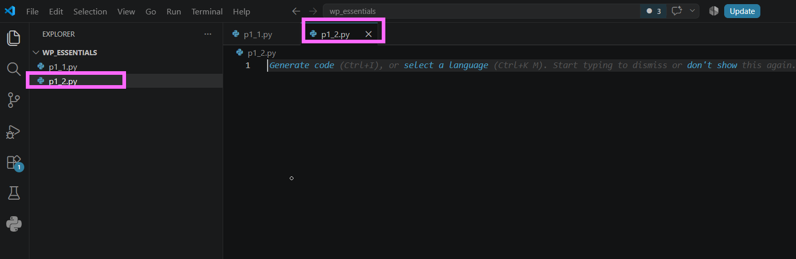

---

### Paso 2. Crear el menú

Escribir el siguiente código.

```python
opcion = 0

while opcion != 5:

    print("\n===== MENÚ =====")
    print("1. Hamburguesas")
    print("2. Sushi")
    print("3. Pizzas")
    print("4. Cervezas")
    print("5. Salir")

    opcion = int(input("Ingrese una opción: "))
```

Guardar el archivo.

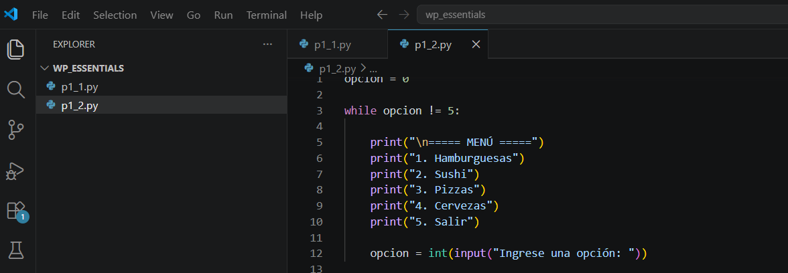

---

## Tarea 2. Agregar las acciones del menú

### Paso 1. Implementar las opciones

Dentro del ciclo `while`, agregar el siguiente código después de leer la opción.

```python
if opcion == 1:
    print("Te recomendamos visitar una hamburguesería.")

elif opcion == 2:
    print("Te recomendamos visitar un restaurante de sushi.")

elif opcion == 3:
    print("Te recomendamos visitar una pizzería.")

elif opcion == 4:

    edad = int(input("Ingrese su edad: "))

    if edad >= 18:
        print("Te recomendamos visitar una cervecería.")
    else:
        print("Menor de edad. No es posible realizar esta recomendación.")

elif opcion == 5:
    print("Gracias por utilizar el programa.")

else:
    print("Opción no válida.")
```

Guardar el archivo.

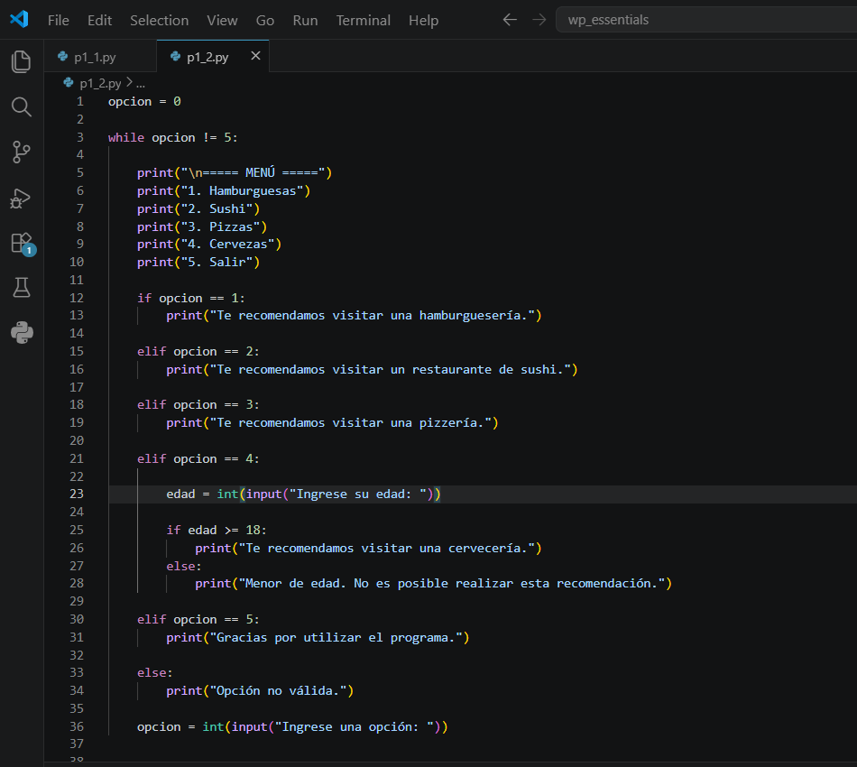

---

## Tarea 3. Ejecutar el programa

### Paso 1. Probar las diferentes opciones

Ejecutar el programa.

```bash
python p1_2.py
```

Seleccionar las opciones del menú y verificar el comportamiento.

Probar al menos los siguientes casos:

- Opción 1
- Opción 2
- Opción 3
- Opción 4 con una edad mayor o igual a 18.
- Opción 4 con una edad menor de 18.
- Una opción inválida.
- Opción 5 para finalizar el programa.

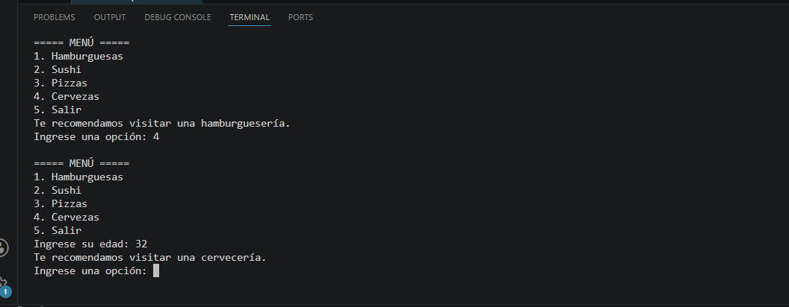


---

## Tarea 4. Analizar el programa

Responder las siguientes preguntas.

1. ¿Qué estructura permite que el menú permanezca activo?

2. ¿Cuál es la función de la variable `opcion`?

3. ¿Qué sucede cuando el usuario selecciona la opción 5?

4. ¿Por qué fue necesario utilizar una estructura `if` anidada en la opción 4?

5. ¿Qué ocurre si el usuario escribe un número diferente de las opciones disponibles?

---

# Validación

Verifique que realizó correctamente las siguientes actividades.

| Actividad | Completado |
|------------|------------|
| Creó el archivo `p1_2.py` | ☐ |
| Implementó un ciclo `while` | ☐ |
| Mostró un menú interactivo | ☐ |
| Utilizó estructuras `if`, `elif` y `else` | ☐ |
| Validó la edad del usuario | ☐ |
| Mantuvo el programa en ejecución hasta seleccionar "Salir" | ☐ |
| Respondió las preguntas de análisis | ☐ |

---

# Resultado esperado

Al finalizar la práctica el programa deberá mostrar un menú similar al siguiente:

```text
===== MENÚ =====

1. Hamburguesas
2. Sushi
3. Pizzas
4. Cervezas
5. Salir

Ingrese una opción:
```

Dependiendo de la opción seleccionada, el programa mostrará la recomendación correspondiente y continuará ejecutándose hasta que el usuario seleccione la opción **5. Salir**.


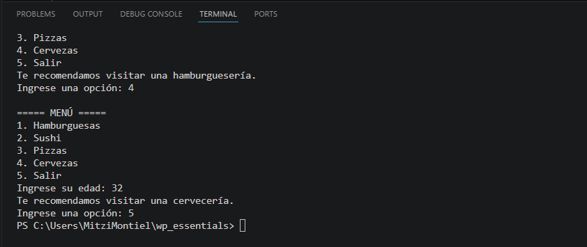

---

# Conclusión

Durante esta práctica desarrollaste un menú interactivo utilizando un ciclo `while` y estructuras condicionales. También implementaste una validación mediante un `if` anidado para controlar el acceso a una opción específica según la edad del usuario.

Este tipo de programas constituye la base para desarrollar aplicaciones con navegación por menús, sistemas administrativos y programas interactivos más complejos.

---

# Conocimientos adquiridos

Al finalizar esta práctica aprendiste a:

- Utilizar ciclos `while`.
- Implementar estructuras `if`, `elif` y `else`.
- Crear menús interactivos.
- Validar información ingresada por el usuario.
- Controlar el flujo de ejecución de un programa.
- Finalizar un programa mediante una condición de salida.

---
# Práctica 1.3. Control de flujo

## Objetivo de la práctica

Al finalizar esta práctica, serás capaz de:

- Comprender el funcionamiento de la cláusula `else` asociada a un ciclo `while`.
- Identificar cuándo se ejecuta el bloque `else` y cuándo no.
- Analizar el efecto de la instrucción `break` sobre la ejecución del ciclo.

---

# Objetivo visual

Durante esta práctica desarrollarás un programa que recorrerá una secuencia de números utilizando un ciclo `while` y observarás el comportamiento de la cláusula `else`.

```text
        Abrir Visual Studio Code
                   │
                   ▼
         Crear el archivo p1_3.py
                   │
                   ▼
        Ejecutar un ciclo while
                   │
                   ▼
     ¿El ciclo terminó normalmente?
           │                │
          Sí               No (break)
           │                │
           ▼                ▼
 Ejecutar el bloque else   No ejecutar else
                   │
                   ▼
      Analizar el comportamiento
```

---

## Duración aproximada

**8 minutos**

---

# Tabla de ayuda

| Recurso | Valor |
|---------|-------|
| Editor | Visual Studio Code |
| Lenguaje | Python 3 |
| Archivo | `p1_3.py` |
| Estructuras utilizadas | `while`, `if`, `break`, `else` |

---

# Instrucciones

## Tarea 1. Comprender el funcionamiento de `while...else`

### Paso 1. Crear un nuevo archivo

Crear un archivo llamado:

```text
p1_3.py
```
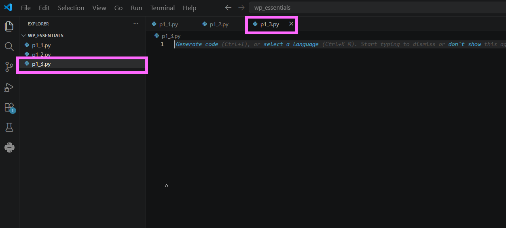

---

### Paso 2. Escribir el siguiente código

Agregar el siguiente programa.

```python
var = 1

while var < 10:
    print(var)
    var += 1

else:
    print("El valor final de var es:", var)
```

Guardar el archivo.

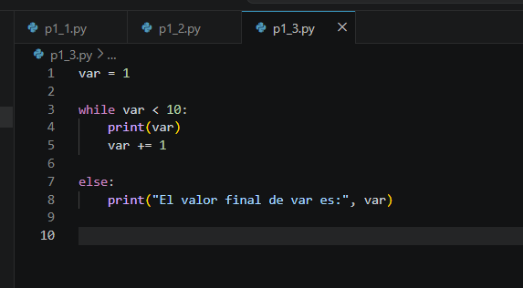

---

### Paso 3. Ejecutar el programa

Ejecutar el archivo.

```bash
python p1_3.py
```

Observar que el mensaje del bloque `else` se muestra al finalizar el ciclo.

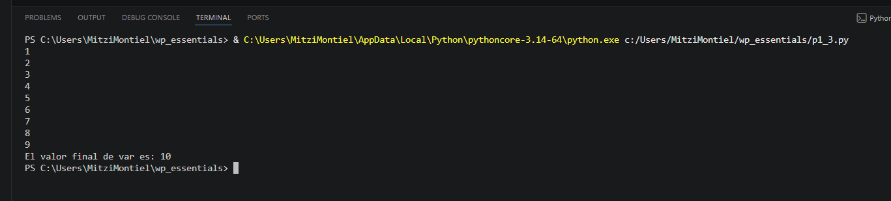

---

## Tarea 2. Mostrar únicamente los múltiplos de 5

### Paso 1. Modificar el código

Actualizar el programa para que únicamente muestre los múltiplos de 5.

```python
var = 1

while var <= 100:

    if var % 5 == 0:
        print(var)

    var += 1

else:
    print("El valor final de var es:", var)
```

Guardar el archivo.

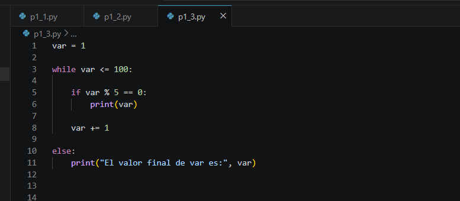


---

### Paso 2. Ejecutar nuevamente

Verificar que únicamente se impriman los múltiplos de 5 y que el mensaje del `else` continúe apareciendo.

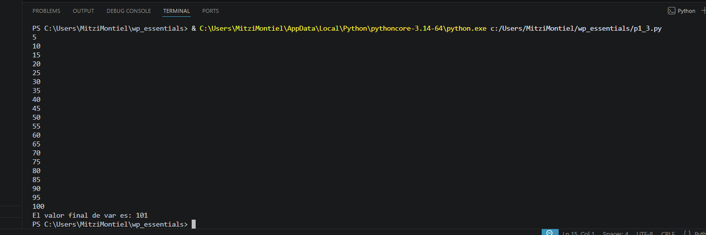

---

## Tarea 3. Interrumpir el ciclo utilizando `break`

### Paso 1. Agregar una condición de salida

Modificar el programa para detener el ciclo cuando `var` sea igual a **25**.

```python
var = 1

while var <= 100:

    if var == 25:
        break

    if var % 5 == 0:
        print(var)

    var += 1

else:
    print("El valor final de var es:", var)
```

Guardar el archivo.

> **Nota:** La instrucción `break` finaliza inmediatamente el ciclo, por lo que el bloque `else` no se ejecutará.

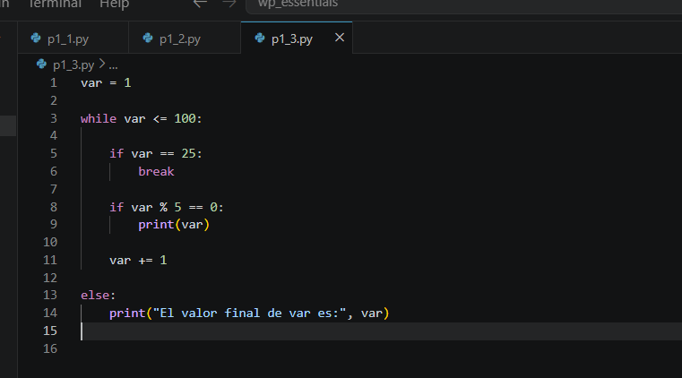


---

### Paso 2. Ejecutar el programa

Observar cuidadosamente el resultado.

Responder:

- ¿Se ejecutó el bloque `else`?
- ¿Por qué ocurrió ese comportamiento?

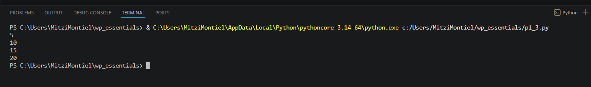

---

## Tarea 4. Analizar el comportamiento del ciclo

Responder las siguientes preguntas.

1. ¿Cuándo se ejecuta el bloque `else` de un ciclo `while`?

2. ¿Qué efecto tiene la instrucción `break`?

3. ¿Qué diferencia observó entre la primera ejecución y la última?

4. ¿En qué tipo de programas considera útil utilizar `while...else`?

---

# Validación

Verifique que realizó correctamente las siguientes actividades.

| Actividad | Completado |
|------------|------------|
| Creó el archivo `p1_3.py` | ☐ |
| Implementó un ciclo `while` | ☐ |
| Utilizó la cláusula `else` | ☐ |
| Mostró únicamente los múltiplos de 5 | ☐ |
| Utilizó la instrucción `break` | ☐ |
| Analizó cuándo se ejecuta el bloque `else` | ☐ |

---

# Resultado esperado

Al finalizar la práctica el participante comprenderá que el bloque `else` únicamente se ejecuta cuando el ciclo termina de forma natural y que no se ejecuta cuando el ciclo finaliza mediante la instrucción `break`.


---

# Conclusión

En esta práctica comprobaste el funcionamiento de la cláusula `else` asociada a un ciclo `while`. Observaste que este bloque se ejecuta únicamente cuando el ciclo concluye de forma normal y que la instrucción `break` interrumpe el ciclo antes de que el bloque `else` pueda ejecutarse.

Este comportamiento resulta muy útil cuando se desea realizar una acción únicamente si el ciclo terminó correctamente y no fue interrumpido.

---

# Conocimientos adquiridos

Al finalizar esta práctica aprendiste a:

- Utilizar ciclos `while`.
- Implementar la cláusula `else` en un ciclo.
- Utilizar la instrucción `break`.
- Comprender cuándo se ejecuta el bloque `else`.
- Controlar el flujo de ejecución de un programa.