# Práctica 2.1. Listas y comprensión de listas

## Objetivo de la práctica

Al finalizar esta práctica, serás capaz de:

- Crear y manipular listas en Python.
- Realizar operaciones de acceso, búsqueda y copia de listas.
- Generar nuevas listas mediante **List Comprehension**.
- Aplicar operaciones matemáticas sobre los elementos de una lista.

---

# Objetivo visual

Durante esta práctica crearás una lista, realizarás diferentes operaciones sobre ella y generarás una nueva lista utilizando comprensión de listas.

```text
        Abrir Visual Studio Code
                   │
                   ▼
         Crear el archivo p2_1.py
                   │
                   ▼
          Crear una lista
                   │
                   ▼
      Acceder y consultar datos
                   │
                   ▼
          Copiar la lista
                   │
                   ▼
       Agregar nuevos elementos
                   │
                   ▼
      Calcular el promedio
                   │
                   ▼
     Crear una nueva lista con
      comprensión de listas
```

---

## Duración aproximada

**8 minutos**

---

# Tabla de ayuda

| Recurso | Valor |
|---------|-------|
| Editor | Visual Studio Code |
| Lenguaje | Python 3 |
| Archivo | `p2_1.py` |
| Funciones utilizadas | `print()`, `sum()`, `len()` |
| Métodos utilizados | `copy()`, `append()` |

---

# Instrucciones

## Tarea 1. Crear una lista

### Paso 1. Crear un nuevo archivo

Crear un archivo llamado:

```text
p2_1.py
```

**Captura esperada**

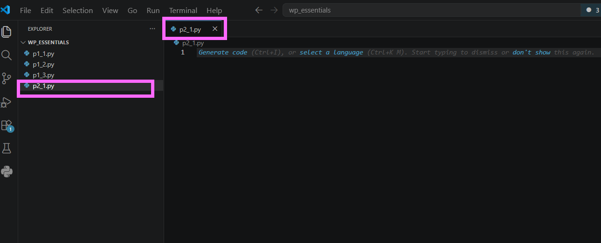

---

### Paso 2. Crear la lista

Escribir el siguiente código.

```python
numeros = [19, 13, 11, 7, 5, 3, 2]

print(numeros)
```

Guardar el archivo.

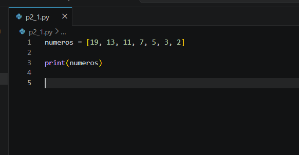

---

### Paso 3. Ejecutar el programa

Ejecutar el archivo.

```bash
python p2_1.py
```

Verificar que la lista se muestre correctamente.

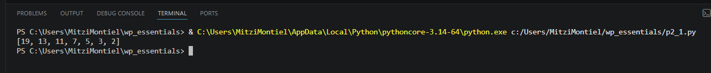

---

## Tarea 2. Explorar la lista

### Paso 1. Verificar un corte de la lista

Agregar la siguiente instrucción.

```python
print(numeros[-1:1])
```

Responder:

- ¿Qué resultado obtiene?
- ¿Por qué la lista está vacía?

> **Nota:** El corte comienza en el último elemento y termina antes de la posición 1. Como el recorrido es hacia adelante y el índice inicial es mayor que el final, el resultado es una lista vacía.

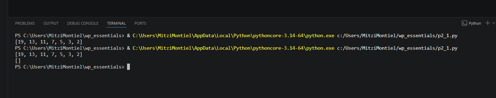


---

### Paso 2. Verificar si un elemento existe

Agregar la siguiente instrucción.

```python
print(23 in numeros)
```

Responder:

- ¿Qué valor devuelve el operador `in`?

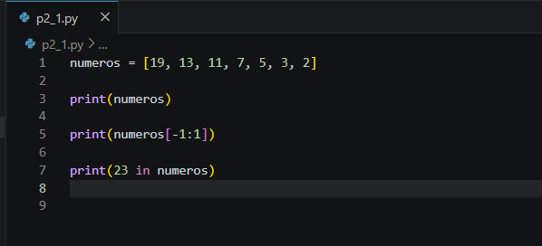


---

## Tarea 3. Copiar y modificar una lista

### Paso 1. Crear una copia

Agregar el siguiente código.

```python
copia = numeros.copy()
```

Después agregar:

```python
copia.append(23)
```

Finalmente imprimir ambas listas.

```python
print("Lista original:", numeros)
print("Copia:", copia)
```

Responder:

- ¿La lista original cambió?

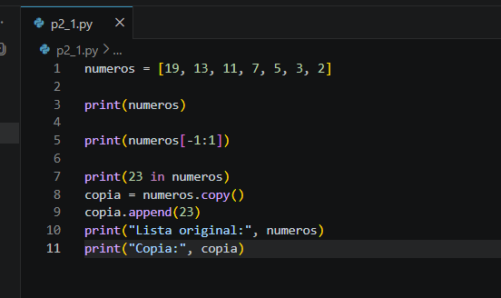

---

## Tarea 4. Calcular el promedio

Agregar el siguiente código.

```python
promedio = sum(numeros) / len(numeros)

print("Promedio:", promedio)
```

Ejecutar nuevamente.

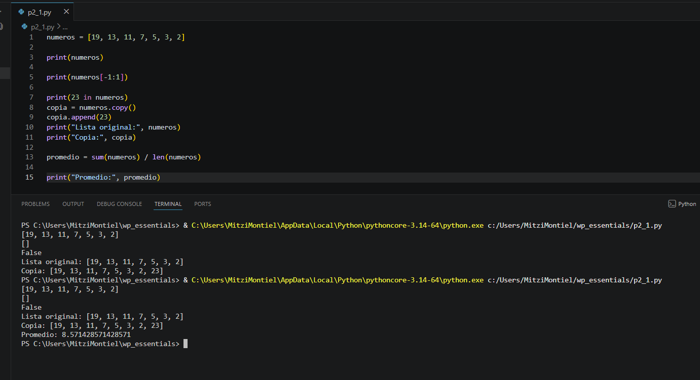


---

## Tarea 5. Utilizar comprensión de listas

Agregar el siguiente código.

```python
pares_cuadrado = [numero ** 2 for numero in numeros if numero % 2 == 0]

print(pares_cuadrado)
```

Responder:

- ¿Qué elementos fueron seleccionados?
- ¿Qué operación realiza la comprensión de listas?

> **Nota:** Una **List Comprehension** permite crear una nueva lista en una sola expresión utilizando un recorrido y una condición opcional.

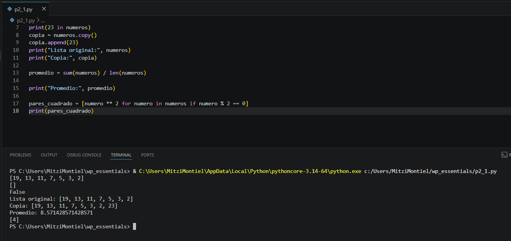

---

## Tarea 6. Analizar los resultados

Responder las siguientes preguntas.

1. ¿Qué diferencia existe entre una lista original y una copia?

2. ¿Qué hace el método `append()`?

3. ¿Para qué sirve el método `copy()`?

4. ¿Qué ventaja ofrece una comprensión de listas respecto a un ciclo tradicional?

5. ¿Qué función cumple la condición `if numero % 2 == 0`?

---

# Validación

Verifique que realizó correctamente las siguientes actividades.

| Actividad | Completado |
|------------|------------|
| Creó el archivo `p2_1.py` | ☐ |
| Creó una lista | ☐ |
| Utilizó el operador `in` | ☐ |
| Realizó un corte (slicing) | ☐ |
| Copió una lista mediante `copy()` | ☐ |
| Agregó un elemento con `append()` | ☐ |
| Calculó el promedio | ☐ |
| Creó una lista mediante comprensión de listas | ☐ |

---

# Resultado esperado

Al finalizar la práctica el programa deberá:

- Mostrar la lista original.
- Verificar la existencia de un elemento.
- Crear una copia independiente.
- Calcular el promedio.
- Generar una nueva lista con los números pares elevados al cuadrado.

Ejemplo de salida:

```text
[19, 13, 11, 7, 5, 3, 2]

[]

False

Lista original: [19, 13, 11, 7, 5, 3, 2]

Copia: [19, 13, 11, 7, 5, 3, 2, 23]

Promedio: 8.57

[4]
```
---

# Conclusión

En esta práctica aprendiste a trabajar con listas en Python realizando operaciones de creación, búsqueda, copia y modificación. También utilizaste funciones integradas para calcular el promedio de los elementos y conociste una de las características más poderosas del lenguaje: las **List Comprehensions**, que permiten generar nuevas listas de forma clara, compacta y eficiente.

---

# Conocimientos adquiridos

Al finalizar esta práctica aprendiste a:

- Crear listas.
- Acceder a elementos mediante slicing.
- Buscar elementos utilizando el operador `in`.
- Copiar listas mediante `copy()`.
- Agregar elementos con `append()`.
- Calcular promedios utilizando `sum()` y `len()`.
- Crear nuevas listas mediante **List Comprehension**.

---
# Práctica 2.2. Slicing de listas

## Objetivo de la práctica

Al finalizar esta práctica, serás capaz de:

- Utilizar la técnica de **slicing** para dividir listas en sublistas.
- Comprender cómo funcionan los índices al realizar cortes sobre una lista.
- Aplicar la función `math.ceil()` para calcular el punto medio de una lista cuando el número de elementos es impar.

---

# Objetivo visual

Durante esta práctica desarrollarás un programa que dividirá una lista en dos partes utilizando slicing.

```text
        Abrir Visual Studio Code
                   │
                   ▼
         Crear el archivo p2_2.py
                   │
                   ▼
        Crear una lista
                   │
                   ▼
      Calcular el punto medio
                   │
                   ▼
      Aplicar slicing [:] 
                   │
                   ▼
     Obtener dos sublistas
                   │
                   ▼
      Mostrar los resultados
```

---

## Duración aproximada

**8 minutos**

---

# Tabla de ayuda

| Recurso | Valor |
|---------|-------|
| Editor | Visual Studio Code |
| Lenguaje | Python 3 |
| Archivo | `p2_2.py` |
| Módulo | `math` |
| Funciones utilizadas | `len()`, `math.ceil()`, `print()` |

---

# Instrucciones

## Tarea 1. Crear el programa

### Paso 1. Crear un nuevo archivo

Crear un archivo llamado:

```text
p2_2.py
```

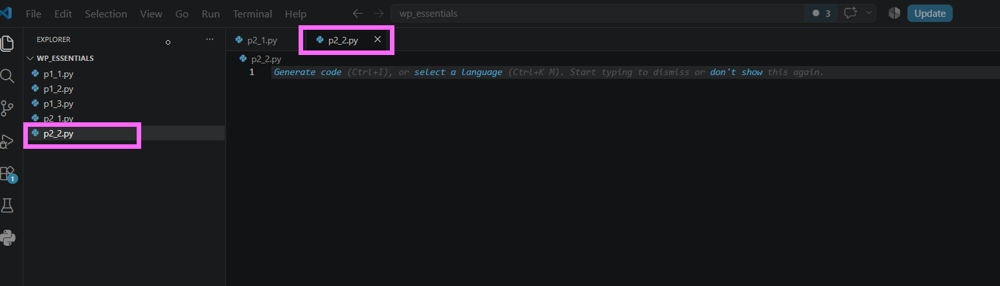


---

### Paso 2. Escribir el código inicial

Agregar el siguiente código.

```python
import math

lista = ["rojo", "azul", "verde", "naranja", "morado"]

colores = []  # Completar posteriormente

print(colores[0])
print(colores[1])
```

Guardar el archivo.

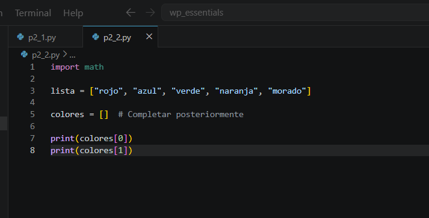


---

## Tarea 2. Dividir la lista utilizando slicing

### Paso 1. Calcular el punto medio

Antes de crear la variable `colores`, agregar la siguiente instrucción.

```python
mitad = math.ceil(len(lista) / 2)
```

> **Nota:** La función `math.ceil()` redondea hacia arriba. Esto permite que la primera sublista tenga un elemento adicional cuando la cantidad de elementos es impar.

---

### Paso 2. Crear las sublistas

Reemplazar la línea:

```python
colores = []
```

por:

```python
colores = [
    lista[:mitad],
    lista[mitad:]
]
```

Guardar el archivo.

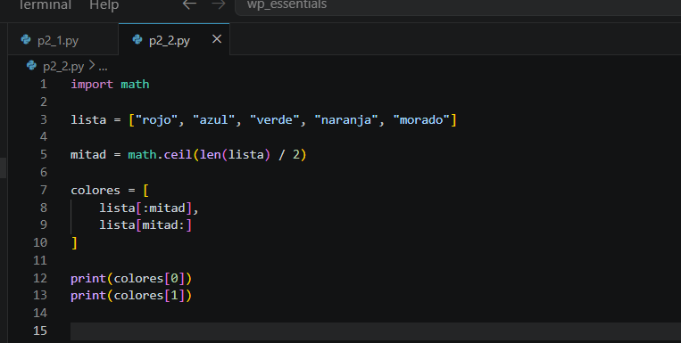

---

## Tarea 3. Ejecutar el programa

### Paso 1. Ejecutar el archivo

Ejecutar el programa.

```bash
python p2_2.py
```

Observar la salida.

```text
['rojo', 'azul', 'verde']

['naranja', 'morado']
```
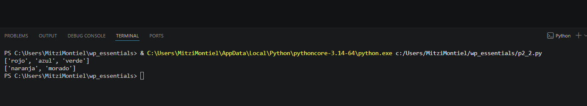

---

## Tarea 4. Experimentar con la lista

Modificar la lista original agregando nuevos colores.

Por ejemplo:

```python
lista = [
    "rojo",
    "azul",
    "verde",
    "naranja",
    "morado",
    "amarillo",
    "negro"
]
```

Ejecutar nuevamente.

Responder:

- ¿Cómo cambió el contenido de las dos sublistas?
- ¿Cuál contiene más elementos?
- ¿Por qué fue necesario utilizar `math.ceil()`?

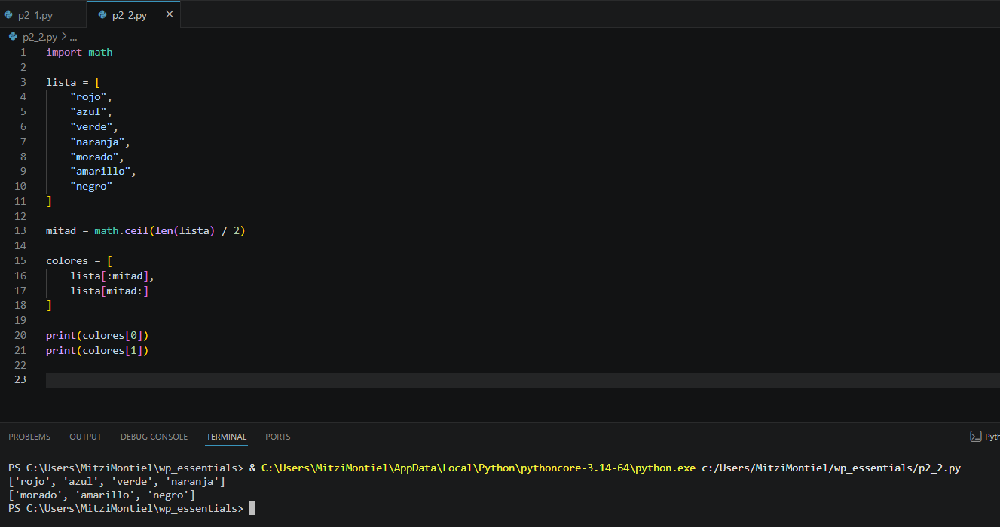

---

## Tarea 5. Analizar los resultados

Responder las siguientes preguntas.

1. ¿Qué hace el operador de slicing `[:]`?

2. ¿Qué representa la variable `mitad`?

3. ¿Por qué se utilizó `math.ceil()` en lugar de una división normal?

4. ¿Qué ocurre si la lista tiene un número par de elementos?

5. ¿Qué ventajas ofrece dividir una lista mediante slicing?

---

# Validación

Verifique que realizó correctamente las siguientes actividades.

| Actividad | Completado |
|------------|------------|
| Creó el archivo `p2_2.py` | ☐ |
| Importó el módulo `math` | ☐ |
| Calculó el punto medio de la lista | ☐ |
| Utilizó slicing para dividir la lista | ☐ |
| Obtuvo dos sublistas | ☐ |
| Probó el programa con una lista diferente | ☐ |

---

# Resultado esperado

Al finalizar la práctica el programa deberá mostrar dos listas independientes.

Ejemplo:

```text
['rojo', 'azul', 'verde']

['naranja', 'morado']
```
y con la nueva lista debe salir:

```text
['rojo', 'azul', 'verde', 'naranja']

['morado', 'amarillo', 'negro']
```

---

# Conclusión

En esta práctica aprendiste a dividir una lista en dos partes utilizando la técnica de **slicing**. También comprobaste cómo la función `math.ceil()` permite obtener un punto medio adecuado cuando la cantidad de elementos es impar, garantizando que la primera sublista contenga el elemento adicional.

El uso de slicing es una técnica ampliamente utilizada para manipular colecciones de datos de forma sencilla y eficiente.

---

# Conocimientos adquiridos

Al finalizar esta práctica aprendiste a:

- Importar módulos de Python.
- Utilizar la función `math.ceil()`.
- Obtener la longitud de una lista mediante `len()`.
- Dividir listas utilizando slicing.
- Crear listas que contienen otras listas.
- Comprender cómo se realizan los cortes sobre colecciones.

---

# Práctica 2.3. Diccionarios

## Objetivo de la práctica

Al finalizar esta práctica, serás capaz de:

- Crear y utilizar diccionarios en Python para almacenar información mediante pares **clave-valor**.
- Capturar datos ingresados por el usuario y almacenarlos en un diccionario.
- Acceder y modificar valores existentes en un diccionario.
- Calcular el promedio de las calificaciones almacenadas.

---

# Objetivo visual

Durante esta práctica desarrollarás un programa que almacenará calificaciones en un diccionario, calculará el promedio y permitirá modificar una materia para recalcular el resultado.

```text
        Abrir Visual Studio Code
                   │
                   ▼
         Crear el archivo p2_3.py
                   │
                   ▼
     Capturar las calificaciones
                   │
                   ▼
      Guardarlas en un diccionario
                   │
                   ▼
      Calcular el promedio
                   │
                   ▼
   Modificar una calificación
                   │
                   ▼
     Calcular el nuevo promedio
```

---

## Duración aproximada

**8 minutos**

---

# Tabla de ayuda

| Recurso | Valor |
|---------|-------|
| Editor | Visual Studio Code |
| Lenguaje | Python 3 |
| Archivo | `p2_3.py` |
| Estructura | Diccionario (`dict`) |
| Funciones utilizadas | `input()`, `int()`, `sum()`, `len()`, `print()` |

---

# Instrucciones

## Tarea 1. Crear el programa

### Paso 1. Crear un nuevo archivo

Crear un archivo llamado:

```text
p2_3.py
```
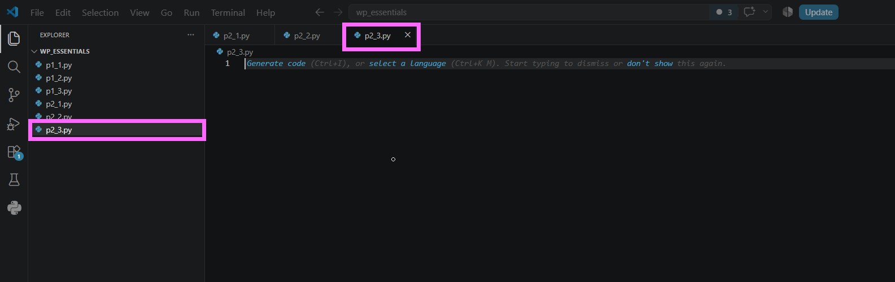

---

### Paso 2. Capturar las calificaciones

Agregar el siguiente código.

```python
calificaciones = {
    "Inglés": int(input("Calificación de Inglés: ")),
    "Matemáticas": int(input("Calificación de Matemáticas: ")),
    "Historia": int(input("Calificación de Historia: ")),
    "Arte": int(input("Calificación de Arte: ")),
    "Música": int(input("Calificación de Música: "))
}
```

Guardar el archivo.

> **Nota:** Se utiliza la función `int()` para convertir las entradas del usuario en valores numéricos enteros.

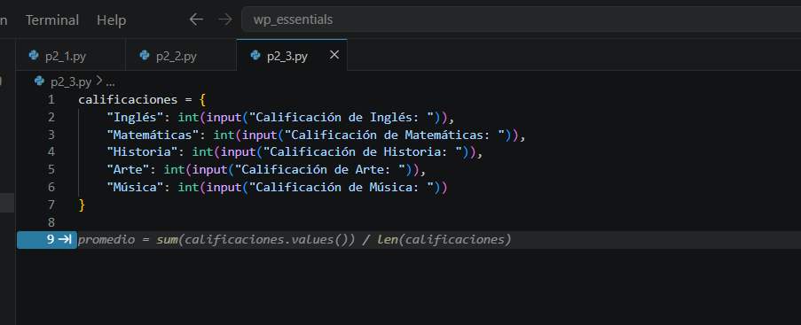

---

## Tarea 2. Calcular el promedio

### Paso 1. Obtener el promedio

Agregar el siguiente código.

```python
promedio = sum(calificaciones.values()) / len(calificaciones)

print(f"\nPromedio actual: {promedio:.2f}")
```

Ejecutar el programa y verificar el resultado.

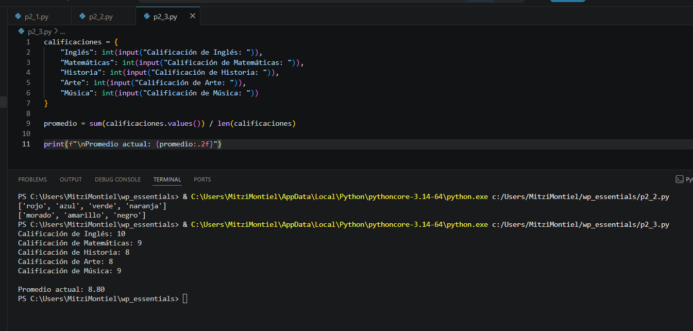

---

## Tarea 3. Modificar una calificación

### Paso 1. Solicitar la materia a modificar

Agregar el siguiente código.

```python
materia = input("\n¿Qué materia desea modificar?: ")
```

---

### Paso 2. Actualizar la calificación

Agregar el siguiente código.

```python
if materia in calificaciones:
    nueva_calificacion = int(input("Nueva calificación: "))
    calificaciones[materia] = nueva_calificacion
else:
    print("La materia no existe en el diccionario.")
```

> **Nota:** Antes de modificar un valor se verifica que la clave exista utilizando el operador `in`.

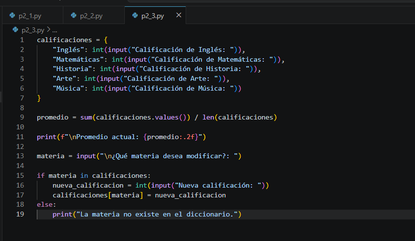

---

## Tarea 4. Calcular el nuevo promedio

Agregar el siguiente código.

```python
promedio = sum(calificaciones.values()) / len(calificaciones)

print("\nCalificaciones actualizadas")

for materia, calificacion in calificaciones.items():
    print(f"{materia}: {calificacion}")

print(f"\nNuevo promedio: {promedio:.2f}")
```

Ejecutar nuevamente el programa.

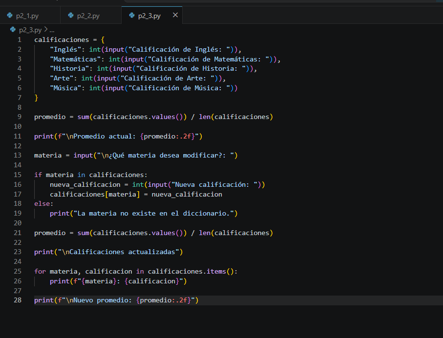

---

## Tarea 5. Analizar los resultados

Responder las siguientes preguntas.

1. ¿Qué representa la clave y el valor dentro de un diccionario?

2. ¿Por qué fue necesario convertir las entradas con `int()`?

3. ¿Qué hace el método `values()`?

4. ¿Qué devuelve el método `items()`?

5. ¿Qué ventaja ofrece un diccionario respecto a una lista para este problema?

---

# Validación

Verifique que realizó correctamente las siguientes actividades.

| Actividad | Completado |
|------------|------------|
| Creó el archivo `p2_3.py` | ☐ |
| Capturó las cinco calificaciones | ☐ |
| Almacenó la información en un diccionario | ☐ |
| Calculó el promedio | ☐ |
| Modificó una calificación | ☐ |
| Calculó nuevamente el promedio | ☐ |

---

# Resultado esperado

Al finalizar la práctica el programa deberá permitir capturar las calificaciones, mostrar el promedio, modificar una materia y recalcular el promedio.

Ejemplo de ejecución:

```text
Calificación de Inglés: 90
Calificación de Matemáticas: 95
Calificación de Historia: 85
Calificación de Arte: 100
Calificación de Música: 80

Promedio actual: 90.00

¿Qué materia desea modificar?: Historia

Nueva calificación: 95

Calificaciones actualizadas

Inglés: 90
Matemáticas: 95
Historia: 95
Arte: 100
Música: 80

Nuevo promedio: 92.00
```

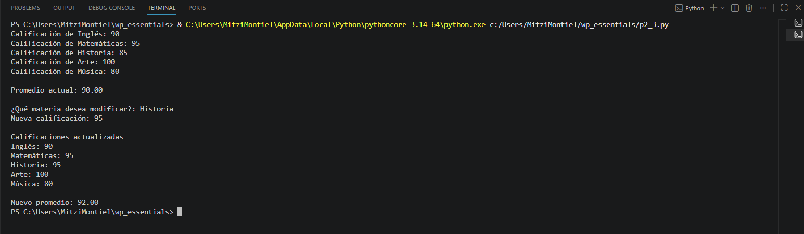

---

# Conclusión

En esta práctica aprendiste a utilizar diccionarios para almacenar información mediante pares **clave-valor**. También calculaste el promedio de las calificaciones utilizando las funciones `sum()` y `len()`, modificaste un elemento del diccionario y comprobaste cómo los cambios se reflejan inmediatamente al volver a procesar los datos.

---

# Conocimientos adquiridos

Al finalizar esta práctica aprendiste a:

- Crear diccionarios.
- Agregar información mediante claves y valores.
- Acceder y modificar elementos de un diccionario.
- Utilizar los métodos `values()` e `items()`.
- Recorrer un diccionario con un ciclo `for`.
- Calcular promedios utilizando la información almacenada en un diccionario.