# Práctica 3.1. Funciones y parámetros

## Objetivo de la práctica

Al finalizar esta práctica, serás capaz de:

- Comprender la diferencia entre **parámetros** y **argumentos** en una función.
- Crear funciones reutilizables en Python.
- Invocar funciones enviando diferentes argumentos.
- Analizar el comportamiento de una función al recibir distintos tipos de datos.

---

# Objetivo visual

Durante esta práctica crearás funciones, las ejecutarás con diferentes argumentos y observarás cómo cambia su comportamiento.

```text
        Abrir Visual Studio Code
                   │
                   ▼
         Crear el archivo p3_1.py
                   │
                   ▼
      Definir funciones
                   │
                   ▼
      Crear la función main()
                   │
                   ▼
      Ejecutar el programa
                   │
                   ▼
      Crear una función con parámetros
                   │
                   ▼
      Invocar la función con
      distintos argumentos
```


---

## Duración aproximada

**8 minutos**

---

# Tabla de ayuda

| Recurso | Valor |
|---------|-------|
| Editor | Visual Studio Code |
| Lenguaje | Python 3 |
| Archivo | `p3_1.py` |
| Conceptos | Funciones, parámetros, argumentos |
| Funciones utilizadas | `print()` |

---

# Instrucciones

## Tarea 1. Analizar funciones sin parámetros

### Paso 1. Crear un nuevo archivo

Crear un archivo llamado:

```text
p3_1.py
```
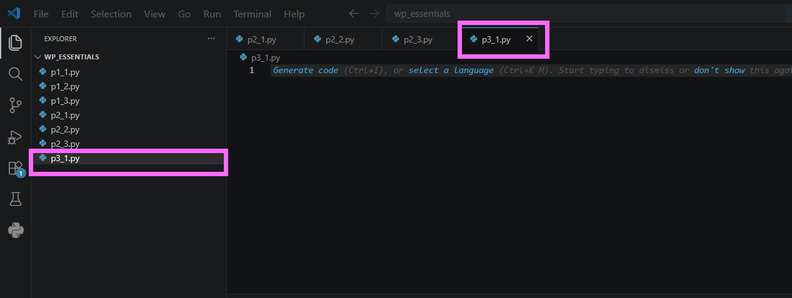

---

### Paso 2. Escribir el código inicial

Agregar el siguiente código.

```python
def suma_1_y_2():

    suma = 1 + 2

    print("1 + 2 =", suma)


def suma_3_y_4():

    suma = 3 + 4

    print("3 + 4 =", suma)


def main():

    suma_1_y_2()

    suma_3_y_4()


main()
```

Guardar el archivo.

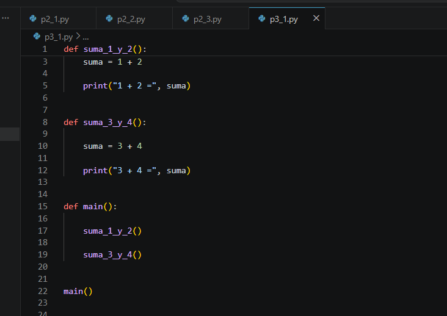

---

### Paso 3. Ejecutar el programa

Ejecutar el archivo.

```bash
python p3_1.py
```

Observar la salida.

Responder:

- ¿Qué ventaja tiene utilizar funciones?

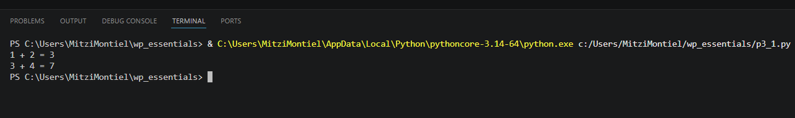

---

## Tarea 2. Comprender parámetros y argumentos

Antes de continuar, responder la siguiente pregunta.

> **¿Cuál es la diferencia entre un parámetro y un argumento?**

> **Nota:** Un **parámetro** es la variable definida en la función. Un **argumento** es el valor que se envía al llamar a la función.

---

## Tarea 3. Crear una función con parámetros

### Paso 1. Agregar una nueva función

Debajo del código anterior agregar la siguiente función.

```python
def suma(numero1, numero2):

    resultado = numero1 + numero2

    print(f"{numero1} + {numero2} = {resultado}")
```

---

### Paso 2. Invocar la función

Agregar las siguientes llamadas.

```python
suma(5, 8)

suma(100, 250)

suma(-3, 10)
```

Ejecutar nuevamente el programa.

Responder:

- ¿Cuántas funciones diferentes fueron necesarias para realizar todas las sumas?

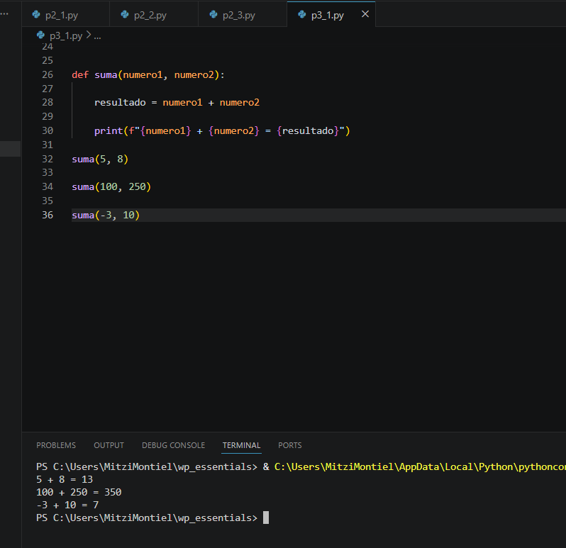

---

## Tarea 4. Experimentar con diferentes argumentos

Modificar las llamadas anteriores y probar los siguientes casos.

```python
suma(10.5, 5.3)
```

Después probar.

```python
suma("Hola ", "Python")
```

Responder:

- ¿Qué ocurrió en cada caso?
- ¿La función tuvo que modificarse?

> **Nota:** En Python el operador `+` puede realizar una suma entre números o una concatenación entre cadenas.

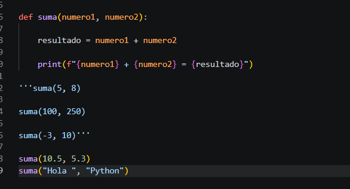

---

## Tarea 5. Analizar los resultados

Responder las siguientes preguntas.

1. ¿Qué diferencia existe entre una función con parámetros y una función sin parámetros?

2. ¿Qué son los argumentos?

3. ¿Qué ventaja tiene reutilizar una función?

4. ¿Por qué no fue necesario crear una función distinta para cada suma?

5. ¿Qué ocurrió cuando se enviaron cadenas de caracteres?

---

# Validación

Verifique que realizó correctamente las siguientes actividades.

| Actividad | Completado |
|------------|------------|
| Creó el archivo `p3_1.py` | ☐ |
| Ejecutó funciones sin parámetros | ☐ |
| Creó una función con parámetros | ☐ |
| Invocó la función con distintos argumentos | ☐ |
| Probó la función con números enteros | ☐ |
| Probó la función con números decimales | ☐ |
| Probó la función con cadenas | ☐ |

---

# Resultado esperado

Al finalizar la práctica el programa deberá producir una salida similar a la siguiente.

```text
1 + 2 = 3

3 + 4 = 7

5 + 8 = 13

100 + 250 = 350

-3 + 10 = 7

10.5 + 5.3 = 15.8

Hola Python
```

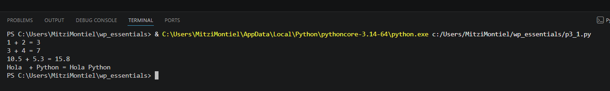


---

# Conclusión

En esta práctica aprendiste que las funciones permiten reutilizar código y hacerlo más fácil de mantener. También comprendiste la diferencia entre **parámetros**, que son las variables definidas por la función, y **argumentos**, que son los valores enviados durante la llamada.

Además, comprobaste que una misma función puede trabajar con diferentes tipos de datos, aprovechando el tipado dinámico de Python.

---

# Conocimientos adquiridos

Al finalizar esta práctica aprendiste a:

- Definir funciones.
- Invocar funciones.
- Utilizar parámetros.
- Enviar argumentos.
- Reutilizar código.
- Comprender la diferencia entre parámetros y argumentos.
- Utilizar una misma función con distintos tipos de datos.

---

# Práctica 3.2. Funciones con parámetros y valores de retorno

## Objetivo de la práctica

Al finalizar esta práctica, serás capaz de:

- Crear funciones que reciban parámetros y devuelvan un valor mediante la instrucción `return`.
- Reutilizar funciones para resolver un mismo problema con diferentes datos de entrada.
- Aplicar operaciones aritméticas dentro de una función.
- Utilizar la función `round()` para controlar la cantidad de decimales en un resultado.

---

# Objetivo visual

Durante esta práctica desarrollarás una función que calcule el Índice de Masa Corporal (IMC) a partir del peso y la estatura de una persona.

```text
        Abrir Visual Studio Code
                   │
                   ▼
         Crear el archivo p3_2.py
                   │
                   ▼
      Crear una función con
      parámetros y return
                   │
                   ▼
     Calcular el IMC
                   │
                   ▼
      Invocar la función
      con distintos datos
                   │
                   ▼
      Mostrar los resultados
```


---

## Duración aproximada

**8 minutos**

---

# Tabla de ayuda

| Recurso | Valor |
|---------|-------|
| Editor | Visual Studio Code |
| Lenguaje | Python 3 |
| Archivo | `p3_2.py` |
| Funciones utilizadas | `round()`, `print()` |
| Conceptos | Parámetros, retorno (`return`) |

---

# Instrucciones

## Tarea 1. Crear una función con valor de retorno

### Paso 1. Crear un nuevo archivo

Crear un archivo llamado:

```text
p3_2.py
```

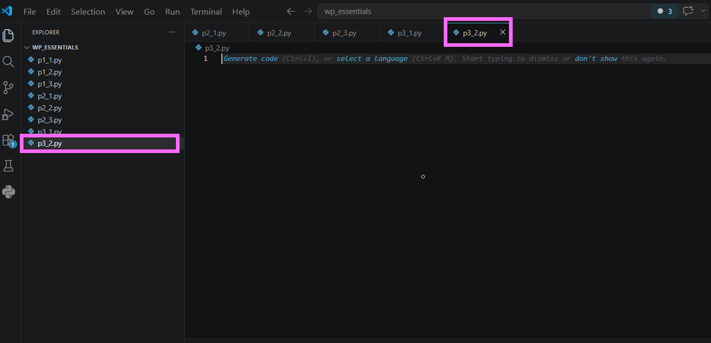


---

### Paso 2. Crear la función

Agregar el siguiente código.

```python
def calcular_imc(peso, estatura):

    estatura_metros = estatura / 100

    imc = peso / (estatura_metros ** 2)

    return round(imc, 1)
```

> **Nota:** La estatura se recibe en centímetros, por lo que primero debe convertirse a metros antes de calcular el IMC.

Guardar el archivo.

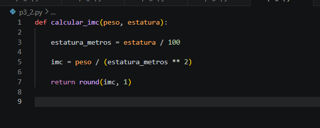


---

## Tarea 2. Invocar la función

### Paso 1. Agregar las llamadas a la función

Debajo de la función agregar el siguiente código.

```python
print("IMC:", calcular_imc(55, 154))

print("IMC:", calcular_imc(55, 169))

print("IMC:", calcular_imc(120, 170))
```

Guardar el archivo.

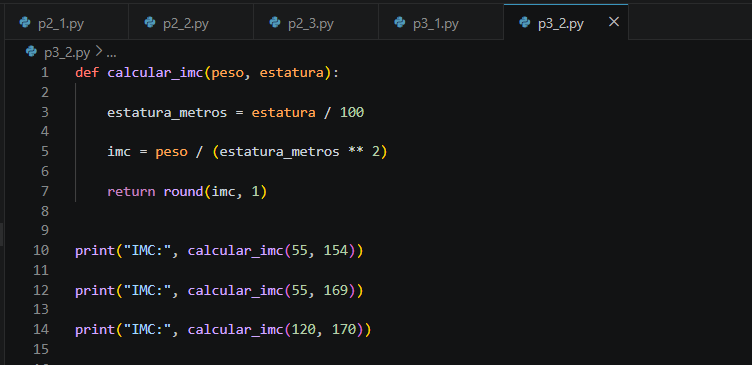

---

### Paso 2. Ejecutar el programa

Ejecutar el archivo.

```bash
python p3_2.py
```

Verificar que la salida sea similar a la siguiente.

```text
IMC: 23.2

IMC: 19.3

IMC: 41.5
```

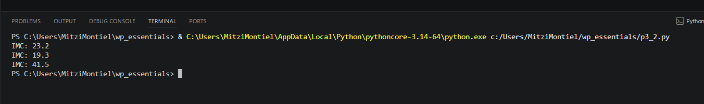

---

## Tarea 3. Probar la función con nuevos datos

Agregar una nueva llamada utilizando diferentes valores.

Por ejemplo:

```python
print("IMC:", calcular_imc(80, 180))
```

Responder:

- ¿Qué resultado obtuvo?
- ¿Fue necesario modificar la función para realizar un nuevo cálculo?

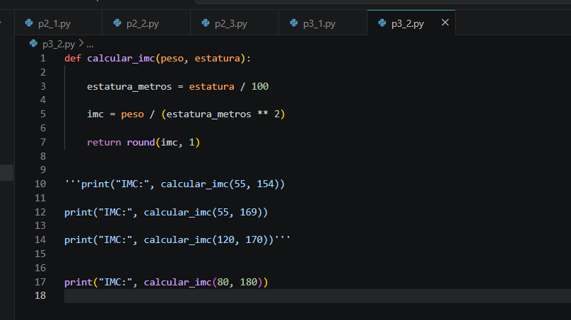

---

## Tarea 4. Analizar el valor de retorno

Responder las siguientes preguntas.

1. ¿Qué hace la instrucción `return`?

2. ¿Qué diferencia existe entre `print()` y `return`?

3. ¿Qué ocurriría si la función no tuviera `return`?

4. ¿Por qué la función puede reutilizarse con diferentes personas?

5. ¿Qué función cumple `round(imc, 1)`?

---

# Validación

Verifique que realizó correctamente las siguientes actividades.

| Actividad | Completado |
|------------|------------|
| Creó el archivo `p3_2.py` | ☐ |
| Definió una función con parámetros | ☐ |
| Utilizó la instrucción `return` | ☐ |
| Calculó el IMC | ☐ |
| Invocó la función con distintos argumentos | ☐ |
| Utilizó la función `round()` | ☐ |

---

# Resultado esperado

Al finalizar la práctica el programa deberá producir una salida similar a la siguiente.

```text
IMC: 23.2

IMC: 19.3

IMC: 41.5

IMC: 24.7
```

> **Nota:** El último resultado corresponde al ejemplo utilizando los valores `80 kg` y `180 cm`.

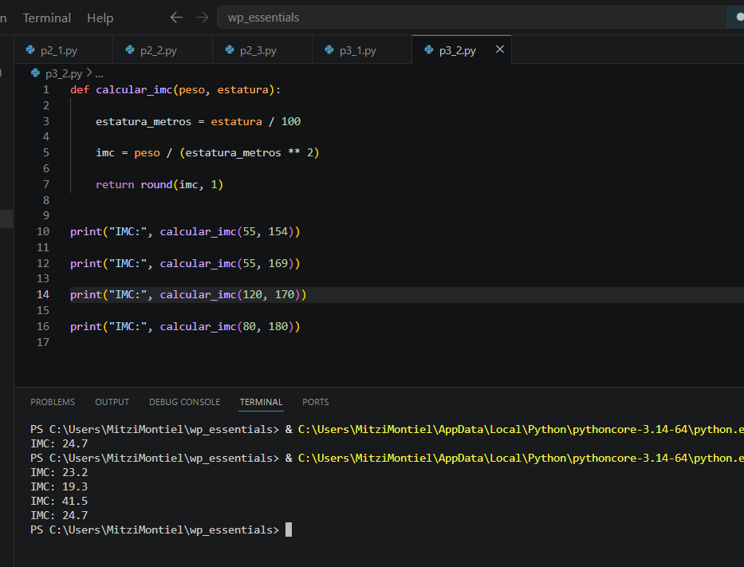

---

# Conclusión

En esta práctica aprendiste a crear funciones que reciben parámetros y devuelven un resultado mediante la instrucción `return`. También comprobaste que una misma función puede reutilizarse con diferentes datos sin necesidad de modificar su implementación, favoreciendo la reutilización del código y la organización de los programas.

---

# Conocimientos adquiridos

Al finalizar esta práctica aprendiste a:

- Definir funciones con parámetros.
- Utilizar la instrucción `return`.
- Reutilizar funciones con diferentes argumentos.
- Aplicar operaciones aritméticas dentro de una función.
- Utilizar la función `round()` para controlar el número de decimales.
- Implementar una función para calcular el Índice de Masa Corporal (IMC).
---

# Práctica 3.3. Diseño modular con funciones

## Objetivo de la práctica

Al finalizar esta práctica, serás capaz de:

- Diseñar programas utilizando un enfoque modular mediante funciones.
- Separar la lógica de un programa en funciones especializadas.
- Reutilizar funciones para calcular el Índice de Masa Corporal (IMC).
- Validar datos ingresados por el usuario para evitar errores durante la ejecución.

---

# Objetivo visual

Durante esta práctica desarrollarás una aplicación modular que calculará el IMC de una persona y mostrará una recomendación de acuerdo con el resultado.

```text
        Abrir Visual Studio Code
                   │
                   ▼
         Crear el archivo p3_3.py
                   │
                   ▼
      Crear la función imc()
                   │
                   ▼
    Crear la función informe()
                   │
                   ▼
      Crear la función main()
                   │
                   ▼
      Capturar los datos
                   │
                   ▼
      Calcular el IMC
                   │
                   ▼
   Mostrar el diagnóstico
```


---

## Duración aproximada

**8 minutos**

---

# Tabla de ayuda

| Recurso | Valor |
|---------|-------|
| Editor | Visual Studio Code |
| Lenguaje | Python 3 |
| Archivo | `p3_3.py` |
| Funciones | `input()`, `print()`, `round()` |
| Conceptos | Funciones, modularidad, validación |

---

# Instrucciones

## Tarea 1. Crear la estructura del programa

### Paso 1. Crear un nuevo archivo

Crear un archivo llamado:

```text
p3_3.py
```

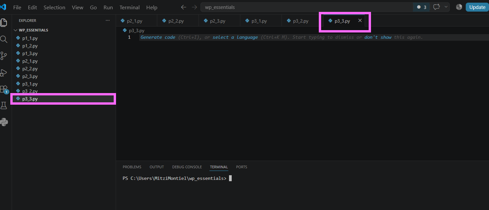

---

### Paso 2. Agregar la estructura del programa

Escribir el siguiente código.

```python
def imc(peso, altura):
    pass


def informe(imc):
    pass


def main():
    pass


main()
```

Guardar el archivo.

> **Nota:** La instrucción `pass` permite definir una función vacía temporalmente mientras se desarrolla el programa.

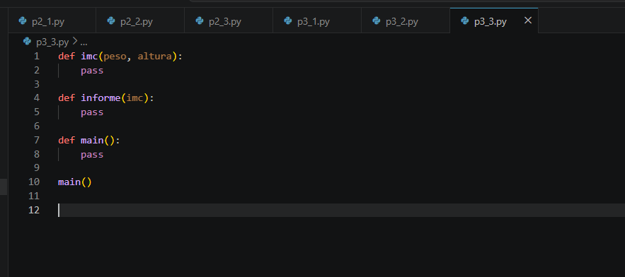

---

# Tarea 2. Implementar la función `imc()`

Reemplazar el contenido de la función por el siguiente código.

```python
def imc(peso, altura):

    altura = altura / 100

    indice = peso / (altura ** 2)

    return round(indice, 1)
```

Guardar el archivo.

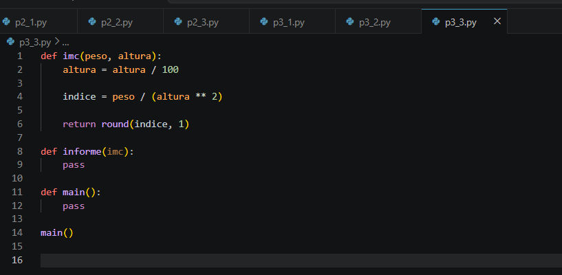


---

# Tarea 3. Implementar la función `informe()`

Completar la función para mostrar el nivel de peso de acuerdo con el IMC.

```python
def informe(indice):

    if indice < 18.5:
        print("Nivel de peso: Bajo peso")

    elif indice < 25:
        print("Nivel de peso: Peso normal")

    elif indice < 30:
        print("Nivel de peso: Sobrepeso")

    else:
        print("Nivel de peso: Obesidad")
```

Guardar el archivo.

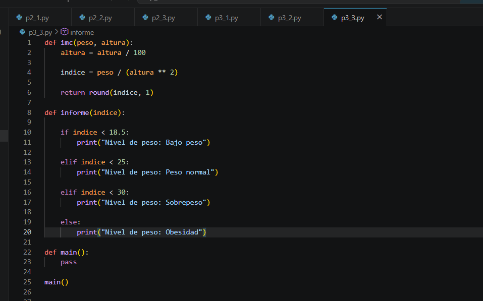

---

# Tarea 4. Implementar la función `main()`

Completar la función principal.

```python
def main():

    peso = float(input("Ingrese el peso (kg): "))

    altura = float(input("Ingrese la estatura (cm): "))

    indice = imc(peso, altura)

    print(f"\nIMC: {indice}")

    informe(indice)
```

Guardar el archivo.

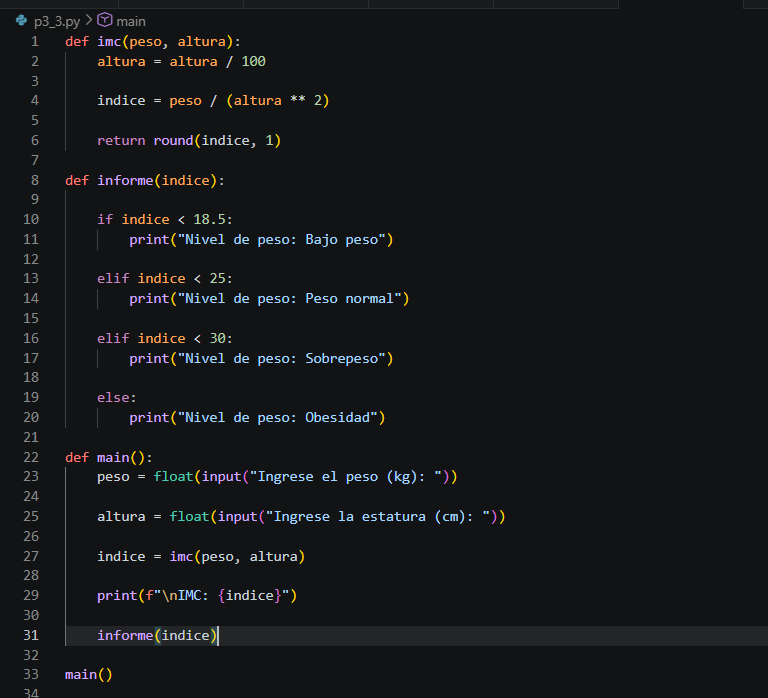

---

# Tarea 5. Ejecutar el programa

Ejecutar el archivo.

```bash
python p3_3.py
```

Probar con los siguientes datos.

| Peso | Estatura |
|------:|----------:|
| 55 | 154 |
| 55 | 169 |
| 120 | 170 |

Verificar que el programa muestre el IMC y el nivel de peso correspondiente.

**Captura esperada**

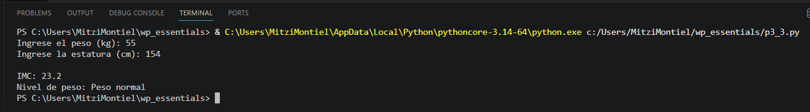

---

# Tarea 6. Validar la estatura

Modificar la función `main()` para validar que la estatura sea mayor que cero.

```python
if altura <= 0:
    print("La estatura debe ser mayor que cero.")
    return
```

Colocar esta validación antes de llamar a la función `imc()`.

Ejecutar nuevamente el programa e ingresar una estatura igual a **0**.

Responder:

- ¿Qué ocurría antes de agregar la validación?
- ¿Qué sucede ahora?

> **Nota:** La validación evita una división entre cero, una de las excepciones más comunes al realizar operaciones matemáticas.


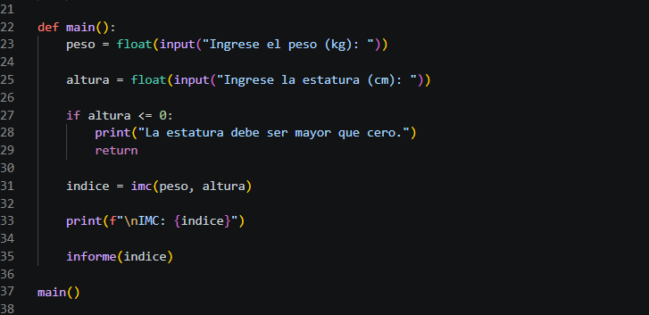

---

# Tarea 7. Analizar el diseño modular

Responder las siguientes preguntas.

1. ¿Qué responsabilidad tiene la función `imc()`?

2. ¿Qué responsabilidad tiene la función `informe()`?

3. ¿Por qué la captura de datos se realiza dentro de `main()`?

4. ¿Qué ventajas ofrece dividir un programa en varias funciones?

5. ¿Qué problemas evitó la validación de la estatura?

---

# Validación

Verifique que realizó correctamente las siguientes actividades.

| Actividad | Completado |
|------------|------------|
| Creó el archivo `p3_3.py` | ☐ |
| Implementó la función `imc()` | ☐ |
| Implementó la función `informe()` | ☐ |
| Implementó la función `main()` | ☐ |
| Calculó correctamente el IMC | ☐ |
| Mostró el nivel de peso | ☐ |
| Validó que la estatura fuera mayor que cero | ☐ |

---

# Resultado esperado

Ejemplo de ejecución.

```text
Ingrese el peso (kg): 55

Ingrese la estatura (cm): 154

IMC: 23.2

Nivel de peso: Peso normal
```

Si el usuario ingresa una estatura inválida.

```text
Ingrese el peso (kg): 70

Ingrese la estatura (cm): 0

La estatura debe ser mayor que cero.
```

---

# Conclusión

En esta práctica aprendiste a desarrollar un programa utilizando un enfoque modular, asignando una responsabilidad específica a cada función. Además, comprobaste la importancia de validar los datos de entrada antes de realizar cálculos, logrando aplicaciones más robustas, reutilizables y fáciles de mantener.

---

# Conocimientos adquiridos

Al finalizar esta práctica aprendiste a:

- Diseñar programas modulares.
- Crear funciones con responsabilidades específicas.
- Utilizar funciones para reutilizar código.
- Implementar funciones que devuelven valores.
- Validar datos de entrada.
- Evitar errores por división entre cero.
- Organizar la lógica de un programa mediante la función `main()`.
---

# Práctica 3.4. Parámetros con valores predeterminados

## Objetivo de la práctica

Al finalizar esta práctica, serás capaz de:

- Crear funciones con parámetros que tengan valores predeterminados.
- Invocar una misma función utilizando diferente cantidad de argumentos.
- Comprender cómo Python asigna automáticamente los valores por defecto cuando un argumento no es proporcionado.
- Reutilizar funciones para evitar código repetido.

---

# Objetivo visual

Durante esta práctica desarrollarás una función capaz de sumar desde dos hasta cinco números utilizando parámetros con valores predeterminados.

```text
                Crear una función
                       │
                       ▼
        Definir parámetros con valor por defecto
                       │
                       ▼
        Invocar la función con diferente cantidad
                 de argumentos
                       │
                       ▼
           Python completa los parámetros
             utilizando los valores por defecto
                       │
                       ▼
               Mostrar el resultado
```

---

## Duración aproximada

**8 minutos**

---

# Tabla de ayuda

| Recurso | Valor |
|---------|-------|
| Editor | Visual Studio Code |
| Lenguaje | Python 3 |
| Archivo | `p3_4.py` |
| Conceptos | Funciones, parámetros, valores predeterminados |

---

# Instrucciones

## Tarea 1. Crear el archivo del programa

### Paso 1. Crear un nuevo archivo

Crear un archivo llamado:

```text
p3_4.py
```

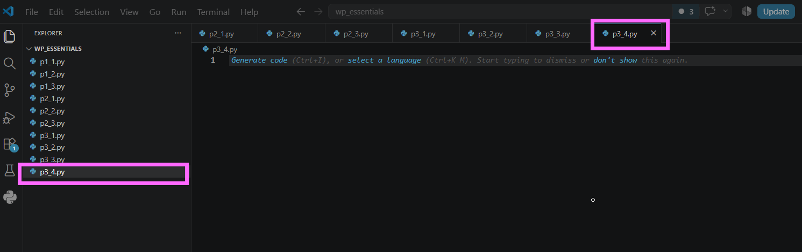

---

## Tarea 2. Crear la función

Escribir la siguiente función.

```python
def suma(num1, num2, num3=0, num4=0, num5=0):

    resultado = num1 + num2 + num3 + num4 + num5

    print(
        f"{num1} + {num2} + {num3} + {num4} + {num5} = {resultado}"
    )
```

> **Nota:** Los parámetros `num3`, `num4` y `num5` tienen como valor predeterminado `0`, por lo que no es obligatorio proporcionar esos argumentos al invocar la función.

Guardar el archivo.

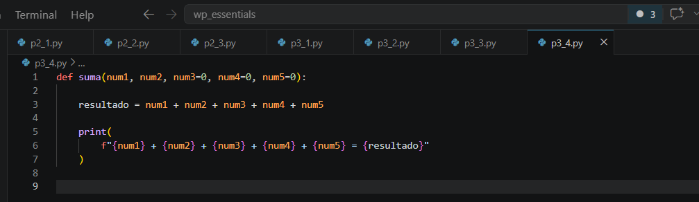

---

## Tarea 3. Crear la función principal

Agregar la función `main()`.

```python
def main():

    suma(1, 2)

    suma(1, 2, 3, 4, 5)

    suma(11, 12, 13, 14)

    suma(101, 201, 301)


main()
```

Guardar el archivo.

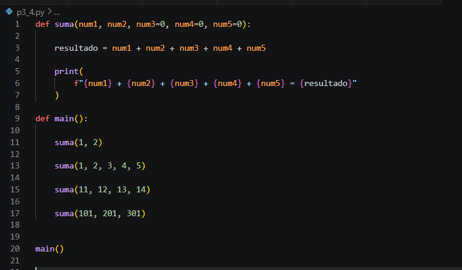

---

## Tarea 4. Ejecutar el programa

Ejecutar el archivo desde la terminal.

```bash
python p3_4.py
```

La salida deberá ser similar a la siguiente.

```text
1 + 2 + 0 + 0 + 0 = 3

1 + 2 + 3 + 4 + 5 = 15

11 + 12 + 13 + 14 + 0 = 50

101 + 201 + 301 + 0 + 0 = 603
```

Responder:

- ¿Por qué algunos valores aparecen como **0**?
- ¿Fue necesario crear varias funciones para realizar las diferentes sumas?

**Captura esperada**

```text
images/lab34-paso04-ejecucion.png
```

---

## Tarea 5. Experimentar con los parámetros

Realizar las siguientes pruebas.

Agregar las siguientes invocaciones dentro de `main()`.

```python
suma(8, 5)

suma(8, 5, 7)

suma(8, 5, 7, 9)

suma(8, 5, 7, 9, 4)
```

Ejecutar nuevamente el programa.

Analizar:

- ¿Qué parámetros utilizan el valor predeterminado?
- ¿Qué sucede cuando se proporcionan los cinco argumentos?

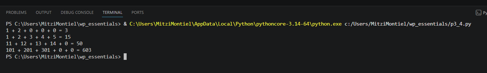

---

## Tarea 6. Modificar los valores predeterminados

Cambiar temporalmente la definición de la función por:

```python
def suma(num1, num2, num3=10, num4=20, num5=30):
```

Ejecutar nuevamente el programa.

Responder:

- ¿Cómo cambió la salida?
- ¿Qué efecto tienen los valores predeterminados sobre el resultado?

Después de responder, regresar los valores predeterminados a **0**.

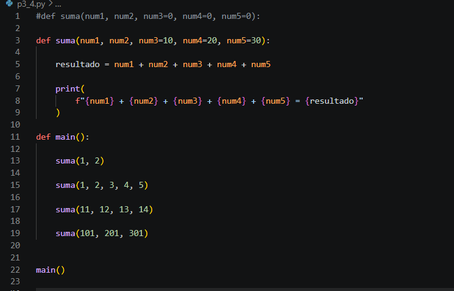


---

# Validación

Verifique que realizó correctamente las siguientes actividades.

| Actividad | Completado |
|------------|------------|
| Creó el archivo `p3_4.py` | ☐ |
| Definió parámetros con valores predeterminados | ☐ |
| Ejecutó la función con diferente cantidad de argumentos | ☐ |
| Verificó que Python utilizó los valores por defecto | ☐ |
| Realizó pruebas adicionales | ☐ |
| Analizó el efecto de cambiar los valores predeterminados | ☐ |

---

# Resultado esperado

Resultado 1: 

```text
1 + 2 + 0 + 0 + 0 = 3

1 + 2 + 3 + 4 + 5 = 15

11 + 12 + 13 + 14 + 0 = 50

101 + 201 + 301 + 0 + 0 = 603
```

Resultado 2: 

```text
1 + 2 + 10 + 20 + 30 = 63

1 + 2 + 3 + 4 + 5 = 15

11 + 12 + 13 + 14 + 30 = 80

101 + 201 + 301 + 20 + 30 = 653
```


# Conclusión

En esta práctica comprobaste que una función puede ser mucho más flexible utilizando parámetros con valores predeterminados. Gracias a esta característica es posible invocar una misma función con distinta cantidad de argumentos, reutilizando el código y evitando crear múltiples funciones para resolver un mismo problema.

---

# Conocimientos adquiridos

Al finalizar esta práctica aprendiste a:

- Crear funciones con parámetros opcionales.
- Utilizar valores predeterminados.
- Invocar funciones con diferente número de argumentos.
- Reutilizar funciones para evitar código duplicado.
- Comprender cómo Python asigna automáticamente los valores por defecto cuando un argumento no es proporcionado.
---
# Práctica 3.5. Funciones y comprensión de listas

## Objetivo de la práctica

Al finalizar esta práctica, serás capaz de:

- Crear funciones que procesen colecciones de datos.
- Utilizar comprensión de listas (*List Comprehension*) para generar nuevas listas.
- Manipular cadenas de texto para extraer información específica.
- Reutilizar funciones para realizar tareas de transformación de datos.

---

# Objetivo visual

Durante esta práctica crearás una función que reciba una lista de nombres completos y devuelva una nueva lista formada únicamente por las iniciales de cada persona.

```text
Lista de nombres
        │
        ▼
Función obtener_iniciales()
        │
        ▼
Comprensión de listas
        │
        ▼
Separar nombre y apellido
        │
        ▼
Extraer iniciales
        │
        ▼
Nueva lista
```

---

## Duración aproximada

**8 minutos**

---

# Tabla de ayuda

| Recurso | Valor |
|---------|-------|
| Editor | Visual Studio Code |
| Lenguaje | Python 3 |
| Archivo | `p3_5.py` |
| Conceptos | Funciones, listas, comprensión de listas, cadenas |

---

# Instrucciones

## Tarea 1. Crear el archivo del programa

### Paso 1. Crear un nuevo archivo

Crear un archivo llamado:

```text
p3_5.py
```

Guardar el archivo.

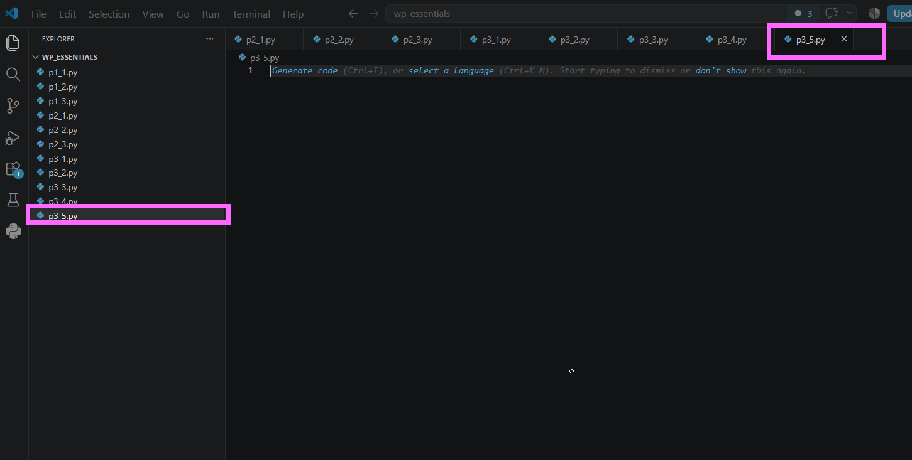

---

## Tarea 2. Crear la lista de nombres

Agregar la siguiente lista al programa.

```python
nombres = [
    "Vicente Fox",
    "Felipe Calderón",
    "Ernesto Zedillo",
    "Carlos Salinas",
    "Luis Echeverría"
]
```

Guardar el archivo.

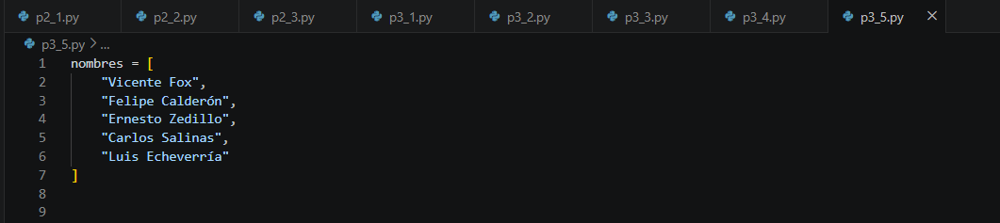


---

## Tarea 3. Crear la función

Crear una función llamada `obtener_iniciales()` que reciba una lista de nombres y devuelva una nueva lista utilizando comprensión de listas.

```python
def obtener_iniciales(lista):

    return [
        f"{nombre.split()[0][0]}. {nombre.split()[1][0]}."
        for nombre in lista
    ]
```

> **Nota:** La función `split()` divide cada nombre en palabras y posteriormente se obtiene la primera letra del nombre y del apellido.


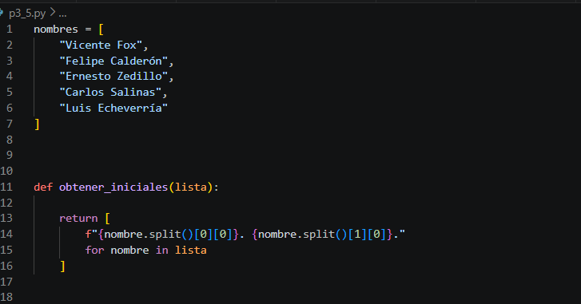


---

## Tarea 4. Invocar la función

Agregar el siguiente código.

```python
def main():

    iniciales = obtener_iniciales(nombres)

    for persona in iniciales:
        print(persona)

main()
```

Guardar el archivo.

**Captura esperada**

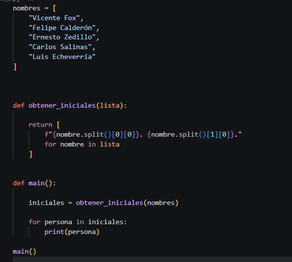


---

## Tarea 5. Ejecutar el programa

Desde la terminal de Visual Studio Code ejecutar:

```bash
python p3_5.py
```

La salida deberá ser similar a la siguiente.

```text
V. F.
F. C.
E. Z.
C. S.
L. E.
```

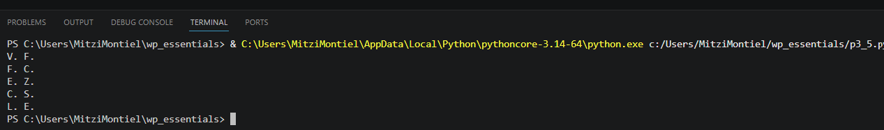

---

## Tarea 6. Agregar más nombres

Agregar dos nombres más a la lista.

Por ejemplo:

```python
"Andrés Manuel"
"Claudia Sheinbaum"
```

Ejecutar nuevamente el programa y verificar que las nuevas iniciales también aparezcan en pantalla.

Responder:

- ¿Fue necesario modificar la función?
- ¿Por qué la comprensión de listas facilita este tipo de procesamiento?


---

# Validación

Verifique que realizó correctamente las siguientes actividades.

| Actividad | Completado |
|------------|------------|
| Creó el archivo `p3_5.py` | ☐ |
| Definió la lista de nombres | ☐ |
| Implementó la función `obtener_iniciales()` | ☐ |
| Utilizó comprensión de listas | ☐ |
| Ejecutó correctamente el programa | ☐ |
| Agregó nuevos nombres y comprobó el funcionamiento | ☐ |

---

# Resultado esperado

```text
V. F.
F. C.
E. Z.
C. S.
L. E.
```

---

# Conclusión

En esta práctica utilizaste una función junto con una comprensión de listas para transformar una colección de datos en una nueva lista con un formato diferente. Este enfoque permite escribir código más limpio, reutilizable y eficiente al procesar grandes cantidades de información.

---

# Conocimientos adquiridos

Al finalizar esta práctica aprendiste a:

- Crear funciones que reciben listas como parámetro.
- Devolver valores desde una función mediante `return`.
- Utilizar comprensión de listas (*List Comprehension*).
- Manipular cadenas mediante `split()`.
- Extraer caracteres específicos utilizando indexación.
- Procesar colecciones de datos de forma compacta y eficiente.
