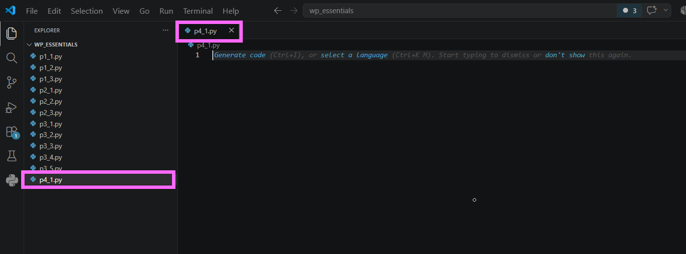
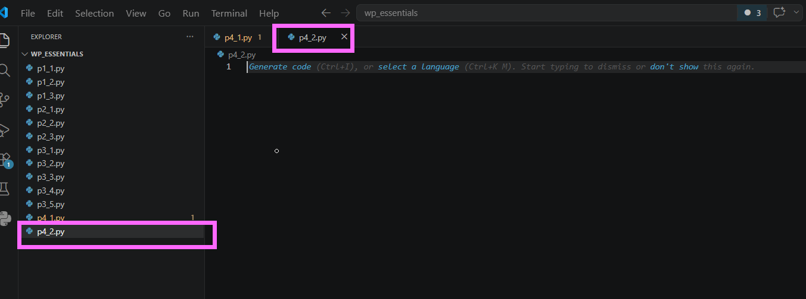
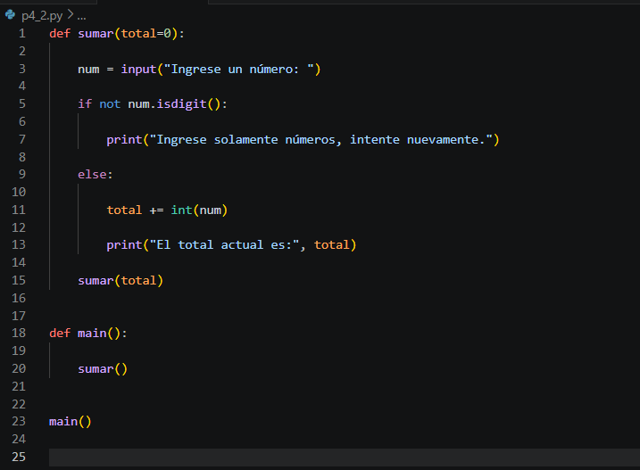
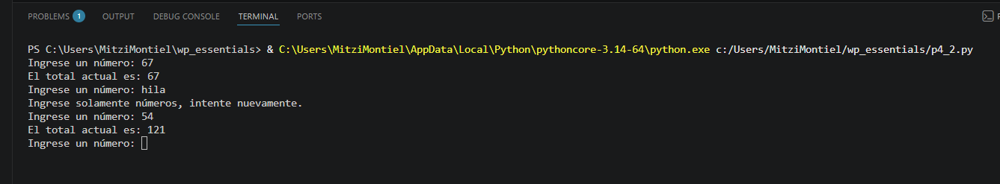
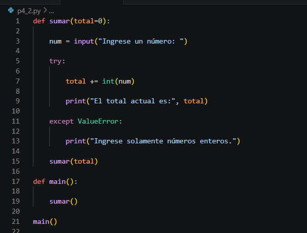
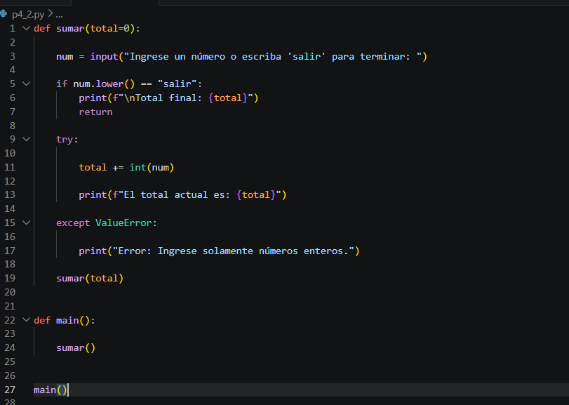

# Práctica 4.1. Manejo de excepciones

## Objetivo de la práctica

Al finalizar esta práctica, serás capaz de:

- Comprender el funcionamiento de las excepciones en Python.
- Identificar los errores más comunes durante la ejecución de un programa.
- Utilizar las estructuras `try` y `except` para controlar errores.
- Analizar la información que proporciona una excepción para facilitar la depuración de programas.

---

# Objetivo visual

Durante esta práctica generarás diferentes tipos de excepciones de manera controlada para observar cómo Python las detecta y las reporta.

```text
Código Python
      │
      ▼
    try
      │
      ▼
Se produce una excepción
      │
      ▼
   except
      │
      ▼
Mostrar el tipo de error
      │
      ▼
Comprender la causa
```
---

## Duración aproximada

**8 minutos**

---

# Tabla de ayuda

| Recurso | Valor |
|---------|-------|
| Editor | Visual Studio Code |
| Lenguaje | Python 3 |
| Archivo | `p4_1.py` |
| Documentación | https://docs.python.org/3/library/exceptions.html |

---

# Instrucciones

## Tarea 1. Crear el archivo

Crear un nuevo archivo llamado:

```text
p4_1.py
```

Guardar el archivo.



---

# Tarea 2. Completar el programa

Copiar el siguiente código en el archivo.

```python
try:
    1 / 0
except Exception as e:
    print(type(e))
    print(e, "\n")


try:
    int("Hola")
except Exception as e:
    print(type(e))
    print(e, "\n")


try:
    print(variable_inexistente)
except Exception as e:
    print(type(e))
    print(e, "\n")


try:
    open("archivo_que_no_existe.txt")
except Exception as e:
    print(type(e))
    print(e, "\n")


try:
    import modulo_que_no_existe
except Exception as e:
    print(type(e))
    print(e, "\n")


try:
    "10" + 5
except Exception as e:
    print(type(e))
    print(e, "\n")


try:
    numero = 10
    numero.upper()
except Exception as e:
    print(type(e))
    print(e, "\n")


try:
    iterador = iter([])
    next(iterador)
except Exception as e:
    print(type(e))
    print(e, "\n")


try:
    persona = {"nombre": "Ana"}
    print(persona["edad"])
except Exception as e:
    print(type(e))
    print(e, "\n")
```

Guardar los cambios.

---

# Tarea 3. Ejecutar el programa

Abrir la terminal de Visual Studio Code y ejecutar:

```bash
python p4_1.py
```

La salida mostrará el tipo de excepción generado en cada bloque.

Deberás observar errores similares a:

```text
<class 'ZeroDivisionError'>

<class 'ValueError'>

<class 'NameError'>

<class 'FileNotFoundError'>

<class 'ModuleNotFoundError'>

<class 'TypeError'>

<class 'AttributeError'>

<class 'StopIteration'>

<class 'KeyError'>
```

> **Nota:** Aunque la práctica original menciona `ImportError`, al intentar importar un módulo inexistente Python genera específicamente la excepción `ModuleNotFoundError`, la cual hereda de `ImportError`.

---

# Tarea 4. Analizar los resultados

Responder las siguientes preguntas.

1. ¿Cuál fue la excepción más sencilla de identificar?
2. ¿Qué información proporciona el objeto `e`?
3. ¿Qué diferencia existe entre `TypeError` y `ValueError`?
4. ¿Qué ventaja tiene utilizar `try` y `except` durante la ejecución de un programa?

---

# Tarea 5. Investigar otra excepción

Consultar la documentación oficial de Python.

https://docs.python.org/3/library/exceptions.html

Elegir una excepción diferente a las utilizadas en esta práctica.

Agregar un nuevo bloque `try/except` que la genere y mostrar su nombre y mensaje.

Por ejemplo:

```python
try:
    lista = [1, 2, 3]
    print(lista[10])
except Exception as e:
    print(type(e))
    print(e)
```

Responder:

- ¿Qué excepción se generó?
- ¿En qué situaciones reales podría aparecer?

**Captura esperada**

```text
images/lab41-paso04-investigacion.png
```

---

# Validación

Verifique que realizó correctamente las siguientes actividades.

| Actividad | Completado |
|------------|------------|
| Creó el archivo `p4_1.py` | ☐ |
| Generó todas las excepciones solicitadas | ☐ |
| Ejecutó correctamente el programa | ☐ |
| Identificó el nombre de cada excepción | ☐ |
| Investigó una excepción adicional | ☐ |
| Respondió las preguntas de análisis | ☐ |

---

# Resultado esperado

Durante la ejecución deberán mostrarse los nombres de las excepciones y sus respectivos mensajes de error.

```text
<class 'ZeroDivisionError'>
division by zero

<class 'ValueError'>
invalid literal for int() with base 10: 'Hola'

<class 'NameError'>
name 'variable_inexistente' is not defined

...
```

---

# Conclusión

En esta práctica aprendiste a utilizar las estructuras `try` y `except` para capturar errores durante la ejecución de un programa. También identificaste diferentes tipos de excepciones comunes en Python y comprendiste la importancia de manejarlas adecuadamente para desarrollar aplicaciones más robustas y fáciles de mantener.

---

# Conocimientos adquiridos

Al finalizar esta práctica aprendiste a:

- Utilizar `try` y `except`.
- Interpretar mensajes de excepción.
- Diferenciar los tipos de errores más comunes en Python.
- Consultar la documentación oficial de excepciones.
- Aplicar buenas prácticas para el manejo de errores.

---

# Práctica 4.2. Sumar indefinidamente

## Objetivo de la práctica

Al finalizar esta práctica, serás capaz de:

- Utilizar excepciones para validar la entrada de datos.
- Sustituir validaciones tradicionales (`if-else`) por bloques `try-except`.
- Implementar funciones recursivas para ejecutar procesos repetitivos.
- Controlar errores de conversión de datos de forma elegante y segura.

---

# Objetivo visual

Durante esta práctica modificarás un programa que suma números de manera indefinida reemplazando las validaciones mediante `if` por el manejo de excepciones.

```text
Usuario ingresa un dato
          │
          ▼
       try:
          │
          ▼
 Convertir a entero
          │
     ┌────┴────┐
     │         │
     ▼         ▼
 Correcto   Excepción
     │         │
     ▼         ▼
Sumar total  Mostrar mensaje
     │         │
     └────┬────┘
          ▼
   Solicitar otro número
```

---

## Duración aproximada

**8 minutos**

---

# Tabla de ayuda

| Recurso | Valor |
|---------|-------|
| Editor | Visual Studio Code |
| Lenguaje | Python 3 |
| Archivo | `p4_2.py` |
| Conceptos | Recursividad, try, except, ValueError |

---

# Instrucciones

## Tarea 1. Crear el archivo

Crear un nuevo archivo llamado:




---

# Tarea 2. Agregar el programa original

Escribir el siguiente código.

```python
# Función suma recursiva

def sumar(total=0):

    num = input("Ingrese un número: ")

    if not num.isdigit():

        print("Ingrese solamente números, intente nuevamente.")

    else:

        total += int(num)

        print("El total actual es:", total)

    sumar(total)


def main():

    sumar()


main()
```

Guardar el archivo.



---

# Tarea 3. Ejecutar el programa

Ejecutar el programa desde la terminal.

```bash
python p4_2.py
```

Realizar varias pruebas:

- Ingresar números enteros.
- Ingresar texto.
- Ingresar caracteres especiales.

Observar el comportamiento del programa.



---

# Tarea 4. Sustituir la validación por manejo de excepciones

Modificar la función `sumar()` eliminando el bloque `if-else`.

Reemplazarlo por el siguiente código.

```python
def sumar(total=0):

    num = input("Ingrese un número: ")

    try:

        total += int(num)

        print("El total actual es:", total)

    except ValueError:

        print("Ingrese solamente números enteros.")

    sumar(total)
```

Guardar el archivo.




---

# Tarea 5. Ejecutar nuevamente el programa

Ejecutar otra vez el archivo.

```bash
python p4_2.py
```

Realizar las siguientes pruebas:

| Entrada | Resultado esperado |
|----------|-------------------|
| 10 | El total aumenta |
| 5 | El total aumenta |
| Hola | Se muestra un mensaje de error |
| Python | Se muestra un mensaje de error |
| 8 | El total continúa acumulándose |

Responder:

- ¿El programa continúa ejecutándose después del error?
- ¿Qué ventaja ofrece `try-except` frente a `if-else` en este caso?

---

# Tarea 6. Mejorar el programa

Modificar el programa para que el usuario pueda escribir:

```text
salir
```

y finalizar la ejecución.

Sugerencia:

```python
if num.lower() == "salir":
    return
```

Probar nuevamente el programa.



---

# Validación

Verifique que realizó correctamente las siguientes actividades.

| Actividad | Completado |
|------------|------------|
| Creó el archivo `p4_2.py` | ☐ |
| Ejecutó el programa original | ☐ |
| Sustituyó `if-else` por `try-except` | ☐ |
| Validó entradas correctas e incorrectas | ☐ |
| Agregó la opción para salir del programa | ☐ |

---

# Resultado esperado

Ejemplo de ejecución.

```text
Ingrese un número: 10
El total actual es: 10

Ingrese un número: 5
El total actual es: 15

Ingrese un número: Hola
Ingrese solamente números enteros.

Ingrese un número: 8
El total actual es: 23

Ingrese un número: salir
```


---

# Conclusión

En esta práctica comprobaste que el manejo de excepciones permite validar entradas de usuario de una manera más limpia y flexible que utilizando múltiples estructuras `if-else`. Además, observaste cómo una función recursiva puede mantener un proceso repetitivo mientras controla errores sin detener la ejecución del programa.

---

# Conocimientos adquiridos

Al finalizar esta práctica aprendiste a:

- Utilizar `try` y `except` para validar datos de entrada.
- Capturar excepciones del tipo `ValueError`.
- Implementar funciones recursivas.
- Mantener un acumulador durante múltiples llamadas recursivas.
- Mejorar la experiencia del usuario mediante el manejo adecuado de errores.